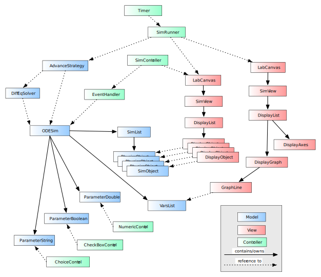
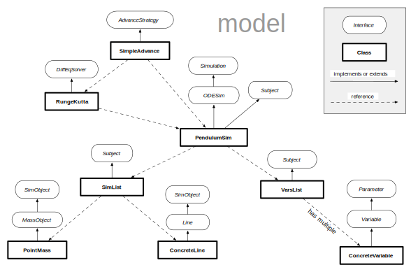
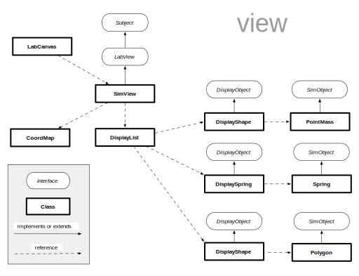
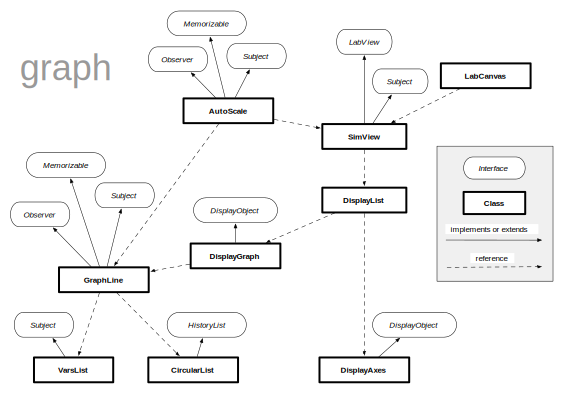
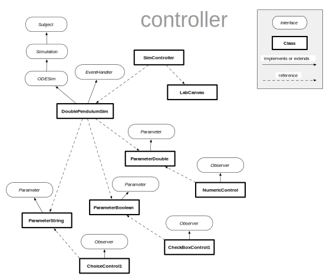
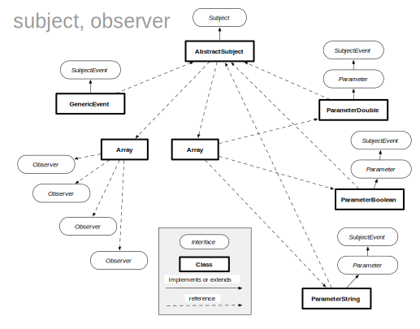

CSS: ./Overview_2.css
Title: Architecture of myPhysicsLab
HTML Header: <meta name="viewport" content="width=device-width, initial-scale=1">

[MVC_arch]: ./Overview_Architecture_MVC.svg
[Model_Classes]: ./Overview_Model_Classes.svg
[Subject_Observer_Classes]: ./Overview_Subject_Observer_Classes.svg

[myPhysicsLab Documentation](index.html)

# myPhysicsLab Architecture

[myPhysicsLab](http://www.myphysicslab.com) provides classes to build real-time
interactive animated physics simulations. This page gives an introduction to the
architecture of the myPhysicsLab software.

Contents of this page:

+ [Overall Architecture][]
+ [Event-Driven Programming][]
+ [Model][] the mathematical model of the simulation
+ [View][] a visual representation of the model
+ [Graph][] graph views of the data generated by the model
+ [Controller][] user interface to modify the simulation
+ [Subject, Observer, Parameter][] the design pattern frequently used here
+ [Application][] the top-level object that creates all other objects
+ [Start-Up HTML File][] details about how the application is created
+ [About Units Of Measurement][]

Additional information:

+ See [myPhysicsLab Documentation](index.html) for detailed documentation of classes and
    interfaces.
+ See [2D Physics Engine Overview](Engine2D.html) for an overview of the 2d rigid body physics
    engine.
+ The [myPhysicsLab website](http://www.myphysicslab.com) shows the simulations
    running and contains explanations of the math behind them.
+ See [Customizing myPhysicsLab Simulations](Customizing.html) about how to customize
    using only a browser and text editor.
+ See [Building myPhysicsLab Software](Building.html) for information about building,
    testing, internationalization, and general programming issues.

# Overall Architecture

_Key Points:_

+ Application creates and initializes objects

+ Model, View, Controller pattern is used thereafter

+ Observer pattern is used extensively

The web page that shows the Simulation **creates the application** and then
tells the application to start. An application is a JavaScript object that creates and
connects all the other objects needed to run and display the Simulation. For example,
here is JavaScript code from `DoublePendulumApp.html` which creates and starts a
simulation:

    app = new mpl.DoublePendulumApp(elem_ids);
    app.defineNames('app');
    app.start();

The `new` command creates the DoublePendulumApp, which in turn **creates the network
of objects** that comprise the simulation.

The app constructor takes an argument (usually of type
[ElementIDs](./types/sims_common_Layout.ElementIDs.html) that specifies the
names of the HTML elementId's to look for in the HTML document; these elements are
where the user interface of the simulation is created, or where to put things like the
canvas or controls.

These `ElementIDs` names are passed in so that we can have two separate simulation apps
running concurrently on a single page. The two apps would give unique names to the HTML
Elements on the page that they occupy.

The above diagram shows a typical set of objects created at startup; these include a
simulation **model** (the blue objects); a set of objects to display a **view** of the
simulation (the red objects); and means for interacting with the model, the
**controller** (the green objects). This follows the well known
[Model, View, Controller Pattern](http://en.wikipedia.org/wiki/Model–view–controller).

The Observer pattern is widely used.  See the section
[Subject, Observer, Parameter][] below.

# Event-Driven Programming

After the application creates the network of objects, there are two ways myPhysicsLab
code is executed:

1.  Objects react to **browser-generated events**.

    Example: a SimController reacts to mousedown events on an HTML canvas.

    Example: a CheckBoxControl reacts to change events on an HTML checkbox control.

2.  A **callback function** is repeatedly executed at around 40 times per second.
    The callback advances the simulation to synchronize with Clock time and
    then redraws the scene.

A [Timer](./classes/lab_util_Timer.Timer.html) object periodically executes the
callback function. Timer is a fancier version of JavaScript's `setInterval()` function.

A [Clock](./classes/lab_util_Clock.Clock.html) keeps track of the
current time. The Clock can run at different speeds; it can be paused; it can be
set to a specific time; and it can keep track of any slippage from real time.

The callback function is typically
[`SimRunner.callback`](./classes/lab_app_SimRunner.SimRunner.html#callback).
The callback tells an [AdvanceStrategy](./interfaces/lab_model_AdvanceStrategy.AdvanceStrategy.html)
to advance the simulation to the current Clock time.

See [Start-Up HTML File][] for more about when the callback is started.

# Model

_Key Points:_

+ Simulation is the model

+ AdvanceStrategy advances the Simulation state thru time

+ Simulation adds SimObjects onto its SimList to reflect the current state

+ Simulation state is stored in Variables in a VarsList

+ Parameters don't change over time

+ Model classes can be used alone, without view or controller

The model consists of the blue colored objects in the
[Model-View-Controller Architecture][MVC_arch] diagram:
ODESim, AdvanceStrategy, VarsList, SimList, SimObjects, Parameters, etc.

The above diagram shows relationships of the main interfaces and classes for a typical
ODESim simulation. These classes are found mostly in the `myphysicslab.lab.model`
namespace.

Most of the myPhysicsLab simulations implement the
[ODESim](./interfaces/lab_model_ODESim.ODESim.html) interface. These are simulations based on
Ordinary Differential Equations (hence the name ODESim). An ODESim has a
[VarsList](./classes/lab_model_VarsList.VarsList.html) which contains the set of variables
that represent the state of the system.

An [AdvanceStrategy](./interfaces/lab_model_AdvanceStrategy.AdvanceStrategy.html) advances the
simulation state in time via the `AdvanceStrategy.advance` method; this is what
`SimRunner.callback` calls to drive the simulation forward in time. An AdvanceStrategy
uses a [DiffEqSolver](./interfaces/lab_model_DiffEqSolver.DiffEqSolver.html) to advance the ODESim
by integrating the differential equations, thus changing the variables. There are 2
implementations of AdvanceStrategy:

+ [SimpleAdvance](./classes/lab_model_SimpleAdvance.SimpleAdvance.html) advances the
    simulation by the requested time step. Used for simulations that do not have
    collisions.

+ [CollisionAdvance](./classes/lab_model_CollisionAdvance.CollisionAdvance.html) handles
    collisions with binary search algorithm to go back
    in time as necessary.

The ODESim keeps a set of [SimObjects](./interfaces/lab_model_SimObject.SimObject.html) in its
[SimList](./classes/lab_model_SimList.SimList.html). Examples of SimObjects include:
[PointMass](./classes/lab_model_PointMass.PointMass.html),
[Spring](./classes/lab_model_Spring.Spring.html),
[RigidBody](./interfaces/lab_engine2D_RigidBody.RigidBody.html), and others. These SimObjects
represent the current state of the simulation and might also be used in the process of
calculating the state at the next moment in time. As a Subject, the SimList notifies
any of its Observers when it adds or removes a SimObject from the SimList; see the
[Subject, Observer, Parameter][] section below.

The simulation state is kept in the [VarsList](./classes/lab_model_VarsList.VarsList.html).
The SimObjects reflect the current state by their position, orientation, velocity, etc.
Anything that varies over time should be stored in the VarsList. The SimObjects
communicate the simulation state with the outside world (they are depicted in a
SimView, as described below).

Because Simulation implements the [Subject](./interfaces/lab_util_Observe.Subject.html)
interface, it can provide various [Parameters](./interfaces/lab_util_Observe.Parameter.html)
for controlling aspects of the simulation which do not change over time. For example, a
[ParameterNumber](./classes/lab_util_Observe.ParameterNumber.html) could represent the
strength of gravity. See the [Subject, Observer, Parameter][] section below.

A Simulation model **can be used alone** without any view or controller classes. For
example, tests such as
[Engine2DTests](./modules/test_Engine2DTests.html) are usually run
without any display or user interface.

See [2D Physics Engine Overview](Engine2D.html) which extends
the `myphysicslab.lab.model` classes to simulate 2D rigid body objects with collisions,
contact forces, gravity, and more.

# View

_Key Points:_

+ LabCanvas manages an HTML5 canvas and draws one or more SimViews

+ SimView draws DisplayObjects which mirror SimObjects

+ A DisplayObject is created for each SimObject

+ SimView has a `screenRect` and a `simRect`

+ CoordMap provides mapping between simulation coordinates and screen coordinates

+ Standard HTML and CSS layout applies to everything on the web page.

The **view** displays the state of the simulation. We are careful to keep the **model**
separate from the **view**. The view consists of the red colored objects in the
[Model-View-Controller Architecture][MVC_arch] diagram: LabCanvas, SimView,
DisplayObjects, and others. These objects are initially created by the application. The
application can customize these objects as desired to modify the look of the
simulation. Most of these classes are part of the `myphysicslab.lab.view` namespace.

A [LabCanvas](./classes/lab_view_LabCanvas.LabCanvas.html) manages an HTML5 canvas
element. A LabCanvas displays one or more
[SimViews](./classes/lab_view_SimView.SimView.html) which can draw into a
LabCanvas.

A [SimView](./classes/lab_view_SimView.SimView.html) draws a set of
[DisplayObjects](./interfaces/lab_view_DisplayObject.DisplayObject.html) (such as
DisplaySpring, DisplayShape) which mirror the state of the
[SimObjects](./interfaces/lab_model_SimObject.SimObject.html) (such as PointMass,
Spring, Polygon).  The DisplayObjects are stored in a
[DisplayList](./classes/lab_view_DisplayList.DisplayList.html) which is accessed via SimView's
[getDisplayList](./classes/lab_view_SimView.SimView.html#getDisplayList) method.

The application decides how to represent each SimObject: what DisplayObject to use,
what color or patterns to use when drawing an object, etc. Such display information is
not part of the model.

For relatively simple simulations, the application will create all the DisplayObjects at
start up. For more complex simulations where
SimObjects are being created and destroyed as the simulation runs, we can create an
[Observer](./interfaces/lab_util_Observe.Observer.html) that watches for additions of
SimObjects to the SimList. The Observer can automatically create an appropriate
DisplayObject for the new SimObject. An example is
[RigidBodyObserver](./classes/sims_engine2D_RigidBodyObserver.RigidBodyObserver.html).
See the [Subject, Observer, Parameter][] section below for more about Observers.

Many DisplayObjects allow specifying a **prototype** DisplayObject. When a display
property (color, line thickness, etc.) is `undefined`, then the property is fetched
from the prototype. If the property is also `undefined` on the prototype then a default
value is used.

The Simulation will modify its SimObjects over time. For example, the location of a
SimObject may change, and therefore the DisplayObject that mirrors that SimObject will
change over time. A DisplayObject has a reference to the SimObject that it represents so
it can query the current state.

A SimView has a `screenRect` and a `simRect` which are respectively the size that the
SimView should occupy in "screen space" (the JavaScript canvas coordinates) and the
rectangle of "simulation space" presented in that screen space.

A SimView has a [CoordMap](./classes/lab_view_CoordMap.CoordMap.html)
which provides a mapping between *simulation coordinates*
and *screen coordinates*:

+ *simulation coordinates*: y coordinate increases **upwards**. Uses floating point
    numbers at any desired scale.

+ *screen coordinates*: y coordinate increases **downwards**. Uses integers where a unit
    equals a pixel on the screen.

**Pan and zoom** effects can be done by changing the SimView's `simRect`. For
example, making the `simRect` smaller has the effect of zooming in. Changing the
`simRect` results in the CoordMap being recalculated accordingly.

Methods like [SimView.panLeft()](./classes/lab_view_SimView.SimView.html#panLeft) and
[SimView.zoomOut()](./classes/lab_view_SimView.SimView.html#zoomOut) can be used to
easily do
pan and zoom effects on a SimView. See
[makePanZoomControls](./classes/sims_common_CommonControls.CommonControls.html#makePanZoomControls)
which makes user interface controls for pan and zoom.

It is common to have two overlapping SimViews in a single LabCanvas: one SimView for
the DisplayObjects that show the simulation state, and another SimView (called the
"status view") where objects such as
[DisplayClock](./classes/lab_view_DisplayClock.DisplayClock.html) or
[EnergyBarGraph](./classes/lab_graph_EnergyBarGraph.EnergyBarGraph.html) are placed. This allows
panning and zooming the simulation objects without affecting the energy or clock
display.

The layout of the canvas and controls on the web page is handled
using **standard HTML and CSS**
techniques. The application is in control of the layout, but it typically will use
classes such as [TabLayout](./classes/sims_common_TabLayout.TabLayout.html),
[CommonControls](./classes/sims_common_CommonControls.CommonControls.html),
[Engine2DApp](./classes/sims_engine2D_Engine2DApp.Engine2DApp.html) and
[AbstractApp](./classes/sims_common_AbstractApp.AbstractApp.html); these aggregate common boiler
plate code for creating controls and views.

The LabCanvas is **periodically repainted** by the callback function, which is
typically [SimRunner.callback](./classes/lab_app_SimRunner.SimRunner.html#callback).

# Graph

_Key Points:_

+ GraphLine gathers data from a VarsList and stores it in a HistoryList

+ DisplayGraph draws the GraphLine

+ DisplayGraph is a DisplayObject that can be added to a SimView

+ AutoScale observes a GraphLine to determine enclosing rectangle, and modifies SimView
    accordingly

The classes in the `myphysicslab.lab.graph` namespace provide the ability to draw
graphs of simulation variables. The graph updates in real time as the simulation
proceeds. A graph is composed of several objects as shown in the diagram below.

An ODESim provides access to its Variables through its
[VarsList](./classes/lab_model_VarsList.VarsList.html) object.
The graph classes only know about the VarsList object, they do not know
about the ODESim object. Therefore a graph can also be made to draw from
other data sources that have a VarsList object; see for example
[GraphCalcApp](./classes/sims_experimental_GraphCalcApp.GraphCalcApp.html) which draws graphs from
equations that are entered in a text field.

A GraphLine stores the current variable values into a
[HistoryList](./interfaces/lab_util_HistoryList.HistoryList.html), which is later used to draw the
graph. Storing of the current variable value happens during the GraphLine's
[memorize](./classes/lab_graph_GraphLine.GraphLine.html#memorize) method. For the `memorize`
method to be called automatically, the GraphLine can be registered with it's SimView by
calling [addMemo](./interfaces/lab_util_Memo.MemoList.html#addMemo) on the SimView, for
example:

    simView.addMemo(graphLine);

That will cause the GraphLine's `memorize` method to be called after each simulation
time step. See [MemoList](./interfaces/lab_util_Memo.MemoList.html) for more about that
process.

A GraphLine defines [Parameters](./interfaces/lab_util_Observe.Parameter.html) that
specify which X and Y variables to draw. A GraphLine has other methods that control how
the graph is drawn such as color, line thickness and whether to draw dots or lines.
These choices can be set by JavaScript commands (in the startup application
script or via the interactive Terminal), or user interface controls can be created so
that the user can easily modify these.

The application creates the graph and the various controls to modify the graph. There
are convenience classes such as
[StandardGraph1](./classes/sims_common_StandardGraph1.StandardGraph1.html) and
[TimeGraph1](./classes/sims_common_TimeGraph1.TimeGraph1.html) which create the various
graph objects and connect them together. The application will typically use classes such
as TabLayout and CommonControls which aggregate common boiler plate code for creating
canvases, HTML divs, and controls.

A [DisplayGraph](./classes/lab_graph_DisplayGraph.DisplayGraph.html) implements
[DisplayObject](./interfaces/lab_view_DisplayObject.DisplayObject.html) and can be added to
a SimView's DisplayList like any other DisplayObject. Just like other DisplayObjects,
the DisplayGraph draws into the SimView using simulation coordinates.
Therefore the **simulation rectangle** of the SimView determines what part of the graph
is visible.

To ensure that a graph is fully visible and occupies the entire SimView, we can make an
[AutoScale](./classes/lab_graph_AutoScale.AutoScale.html) object. The AutoScale observes one
or more GraphLines and keeps track of the rectangle that encloses all of the graph
data. The AutoScale then adjusts the SimView's simulation rectangle when the enclosing
rectangle changes.

# Controller

_Key Points:_

+ SimController sends mouse and key events to an EventHandler

+ EventHandler is often (but not always) implemented by the Simulation

+ User interface controls typically modify a Parameter

The controller classes are the green colored objects in the
[Model-View-Controller Architecture][MVC_arch] diagram: SimController, EventHandler,
NumericControl, CheckBoxControl, ChoiceControl, etc. The user interface classes are in
the `myphysicslab.lab.controls` namespace, the others are found in the
`myphysicslab.lab.app` namespace.

These classes allow user interaction with the simulation. For example the user might
click and drag within a LabCanvas to apply a force to an object in the simulation. The
purpose of the controller classes being separate from the model and view is so that the
user interaction techniques can be modified independent of the model and view.

The application creates the controller objects and connects them to the other objects.
In the typical case a [SimController](./classes/lab_app_SimController.SimController.html) is
connected to a [LabCanvas](./classes/lab_view_LabCanvas.LabCanvas.html) so that the
SimController receives user mouse and keyboard events. The SimController does some
pre-processing of events and then sends the events to the
[EventHandler](./interfaces/lab_app_EventHandler.EventHandler.html) to actually do something.

The **pre-processing** that the SimController does includes translating the events to
simulation coordinates and finding the nearest dragable DisplayObject to the mouse
click.

An EventHandler is often implemented by the Simulation. This violates the separation of
model and controller, but in most cases the effort to separate them is not worthwhile.
To separate model and controller requires giving the Simulation a rich enough API to be
able to change the state of the Simulation, and then inventing a new controller class
that implements the EventHandler interface.

In some cases it makes sense for the EventHandler to be a **separate class** from the
Simulation; an example is
[RigidBodyEventHandler](./classes/lab_app_RigidBodyEventHandler.RigidBodyEventHandler.html) which is
a separate class from [RigidBodySim](./classes/lab_engine2D_RigidBodySim.RigidBodySim.html).
Because RigidBodySim has a rich API it is easy to separate the model and controller. If
desired, it would be possible to invent a different custom EventHandler (other than
RigidBodyEventHandler) to use with RigidBodySim.

Another way to modify a Simulation is by changing its publicly available
[Parameters](./interfaces/lab_util_Observe.Parameter.html). For example, DoublePendulumSim has
a [ParameterNumber](./classes/lab_util_Observe.ParameterNumber.html) that represents the
strength of gravity. A [NumericControl](./classes/lab_controls_NumericControl.NumericControl.html)
or [SliderControl](./classes/lab_controls_SliderControl.SliderControl.html) can be connected with
that gravity Parameter so that the user can change gravity by typing a number or
changing the position of a slider. See the [Subject, Observer, Parameter][] section
below for more about how Parameters work.

Parameters are not required for making user interface controls. For example, you can
make a [NumericControlBase](./classes/lab_controls_NumericControl.NumericControlBase.html) with
just getter and setter functions. Similarly for
[CheckBoxControlBase](./classes/lab_controls_CheckBoxControl.CheckBoxControlBase.html),
[ChoiceControlBase](./classes/lab_controls_ChoiceControl.ChoiceControlBase.html), and
[ButtonControl](./classes/lab_controls_ButtonControl.ButtonControl.html) – these do not need a
Parameter but only a function or two.

# Subject, Observer, Parameter

_Key Points:_

+ This is an implementation of the Observer design pattern

+ A Parameter provides access to a value of a Subject, and meta-information such as
    the name of the Parameter.

+ There are three types of Parameter corresponding to boolean, numeric, and string
     types.

+ Subject broadcasts that a Parameter has changed to all registered Observers

+ Subject broadcasts that a momentary GenericEvent has occured to all registered
    Observers.

The interfaces Subject, Observer, Parameter, and SubjectEvent are widely used
throughout myPhysicsLab. They comprise an implementation of the
[Observer design pattern](http://en.wikipedia.org/wiki/Observer_pattern). They are
defined in the `myphysicslab.lab.util` namespace.

The diagram shows the relationships of a
[AbstractSubject](./classes/lab_util_AbstractSubject.AbstractSubject.html) which has 4 Observers and
3 Parameters and a temporary GenericEvent.

The **Observer Design Pattern** allows objects to interact while knowing very little
about each other. For example, a NumericControl is an Observer which can display and
modify the value of a ParameterNumber belonging to any class, even though the
NumericControl knows nothing about that class except that it implements the Subject
interface. This promotes *information hiding and reuse of software components*.

A [Subject](./interfaces/lab_util_Observe.Subject.html) provides access to a set of
[Parameters](./interfaces/lab_util_Observe.Parameter.html) and notifies all
of its [Observers](./interfaces/lab_util_Observe.Observer.html) when a Parameter
changes. There are three types of Parameter:
[ParameterNumber](./classes/lab_util_Observe.ParameterNumber.html),
[ParameterBoolean](./classes/lab_util_Observe.ParameterBoolean.html), and
[ParameterString](./classes/lab_util_Observe.ParameterString.html).

A Parameter combines these pieces of information:

+ _name:_  for example, 'gravity'

+ _type:_  numeric, boolean, or string

+ _subject:_ the Subject that owns the Parameter

+ _getter:_  a function that returns the value of the Parameter

+ _setter:_ a function that sets the value of the Parameter

Whenever the value of the Parameter changes, the Subject will
[broadcast](./interfaces/lab_util_Observe.Subject.html#broadcast) the change to all its
registered Observers. This happens regardless of how the change occurred: whether by
using the `setValue` method of the Parameter, or by directly calling the setter method
on the Subject.

A Subject also notifies its Observers when a
[GenericEvent](./classes/lab_util_Observe.GenericEvent.html) occurs. These are momentary
events that occur in the Subject. For example, Clock broadcasts a GenericEvent when it
is paused; an Observer like a CheckBoxControl could then modify its appearance to match
the current state of the Clock.

Note that Parameters and GenericEvent all implement the
[SubjectEvent](./interfaces/lab_util_Observe.SubjectEvent.html) interface.

# Application

_Key Points:_

+ Application's constructor creates the objects it needs, possibly including some DOM
    objects.

+ Application is stored in a global variable, for access and to prevent being
    garbage collected.

+ Application is mostly inactive after construction is finished.

+ Helper functions and classes enable sharing common code between applications.

As mentioned [above][Overall Architecture], an application is
**created when the web page loads**. The application is the object that
**creates all the other objects** discussed above.

The application doesn't appear in the
[Model-View-Controller Architecture][MVC_arch] diagram because it makes all those
objects and then is mostly inactive thereafter, except that it holds references to
those objects so they **don't get garbage collected**. (The application object is
**stored in a global variable** so it doesn't get garbage collected itself).

The application is made by a script in the [Start-Up HTML File][]. The HTML file also
defines HTML elements (div, textarea, etc.) for controls or canvas to be placed in. The
script loads, instantiates and starts the application running. See the next section for
more about the start-up process.

The application is **instantiated** with the `new` operator; this is when most of the
work happens for creating the various simulation, display, and control objects. The app
will also create new HTML elements that are added to the
[DOM](https://en.wikipedia.org/wiki/Document_Object_Model), for example user interface
controls or an HTML5 canvas element.

The process of constructing the set of objects in the application is fairly
straightforward. You can read the application code to see what is happening, for example
in [DoublePendulumApp](./classes/sims_pendulum_DoublePendulumApp.DoublePendulumApp.html). There
are many possible ways to set up a simulation and its display and user interface.

Applications often make use of **helper classes** to build the user interface and
display. Using these classes allows sharing code that is identical between applications.
Here are some of them:

+ [AbstractSubject](./classes/lab_util_AbstractSubject.AbstractSubject.html) is an abstract
    base class that provides everything needed to implement the
    [Subject](./interfaces/lab_util_Observe.Subject.html) interface.

+ [AbstractApp](./classes/sims_common_AbstractApp.AbstractApp.html) is an abstract base class
    that creates the standard set of views, graphs and controls which are common to
    many applications that run an ODESim.

+ [Engine2DApp](./classes/sims_engine2D_Engine2DApp.Engine2DApp.html) is an abstract base class
    that creates the standard set of views, graphs and controls which are common to
    many applications that run a RigidBodySim, ImpulseSim, or ContactSim.

+ [CommonControls](./classes/sims_common_CommonControls.CommonControls.html) provides
    various functions for constructing user interface elements; for example the
    "play, pause, rewind" controls are created with
    [makePlaybackControls](./classes/sims_common_CommonControls.CommonControls.html#makePlaybackControls).

+ [TabLayout](./classes/sims_common_TabLayout.TabLayout.html) implements specific ways to
    present the application on the web page; in this case with a tab-based layout
    to show the simulation view, graphs, and controls.

+ [RigidBodyObserver](./classes/sims_engine2D_RigidBodyObserver.RigidBodyObserver.html)
    automatically creates a DisplayObject for any SimObject added to the simulation;
    used with RigidBodySim or its subclasses.

# Start-Up HTML File

_Key Points:_

+ When the web page loads, a script creates the application.

+ Usually the same file name is used for the start-up HTML file and the JavaScript file
    that contains the application code.

+ `elem_ids` object communicates location of HTML elements to application

+ Global variables are created to hold the application and classes

+ It is possible to have multiple applications running on a single web page.

When the web page loads, a script creates the application and starts a
[callback Timer](./classes/lab_util_Timer.Timer.html) running that drives the simulation.
This section describes that start-up process.

In myPhysicsLab the convention is to **use the same name** for the JavaScript
application file and the start-up HTML file. For example, `DoublePendulumApp.html` and
`DoublePendulumApp.js`. After compilation, a **suffix** is added to these file names to
indicate what **language** they use. For example, the German versions would be
`DoublePendulumApp-de.html` and `DoublePendulumApp-de.js`. See documentation about
[Internationalization (i18n)](Building.html#internationalizationi18n).

Here is a **typical start-up script** from the HTML start-up file
`DoublePendulumApp-en.html` (the `-en` suffix means it is
an English version). This script creates a
[DoublePendulumApp](./classes/sims_pendulum_DoublePendulumApp.DoublePendulumApp.html) application
object which is stored in the `app` global variable.

    
    
    
    

The first script tag **loads the compiled version** of the application and various
classes it needs from the file `DoublePendulumApp-en.js`. Loading the compiled
JavaScript file **defines the classes**, but does not instantiate the application.

The second script tag is where the application is actually **instantiated**. The
`elem_ids` object specifies the **id's of various HTML elements** that the application
will use (see below for more on this). The app might create additional HTML elements.
The `defineNames` method is where
[command short names](Customizing.html#commandshortnames) are defined, which are
important for further customization and scripting.

The third script tag runs the application's `setup` method, which can do various
operations such as parse a URL Query Script.
See [Terminal for Script Execution](Customizing.html#terminalforscriptexecution).

The last script tag is what **starts the callback running** which drives the animation.
See [Event-Driven Programming][].

The id's seen in the `elem_ids` object are visible in the HTML file. For example, in
the following fragment you can see the id's such as `container`, `sim_applet`,
`sim_controls`, etc.

    

          

                <textarea id='term_output' cols=80 rows=20 wrap='soft'>
                </textarea>
                <label style='display:inline-block'>command:
                      <input type='text' id='term_input' size='80'>
                </label>
          

          

          

          

          

          

          

          

          

    

Additionally `elem_ids` contains a property `images_dir` which specifies the relative
URL of the directory containing images used by certain user interface controls.

Note that a [global variable](Building.html#globalvariables) `app` is created in
the script which holds the application object. It also makes it possible to
access the various objects from a script, as is discussed further in the section
[Terminal for Script Execution](Customizing.html#terminalforscriptexecution)

It is possible to have **two independent versions** of an application running on a
single page. This is demonstrated in
[MultiSpringApp](http://www.myphysicslab.com/develop/adv-build/sims/springs/MultiSpringApp-en.html)
which has two versions of SingleSpringApp running.
Note that there are two separate sets of HTML elements on that page, each with unique
names specified in the `elem_ids`. To be able to run two or more versions of an
application, it is important to not create any global variables other than the globals
for the applications.

# About Units Of Measurement

The myPhysicsLab simulations do not have units of measurements specified such as
meters, kilograms, seconds. The units of measurement are **dimensionless**, they can be
interpreted however you want, but they must be **consistent within the simulation**.

Consider the
[single spring simulation](./classes/sims_springs_SingleSpringSim.SingleSpringSim.html) as an
example. The units involved are time, distance, mass, and the spring stiffness. The
time, distance and mass are independent of each other and can be regarded as being
whatever units you want. But spring stiffness combines time, distance and mass so its
units are derived from the other units:

    force = mass * acceleration = mass * distance / time^2
    spring stiffness = force / distance = mass / time^2

If you decide to use seconds, meter, and kilogram for the units, then force and spring
stiffness must be in units of

    force = kilogram * meter / second^2 = newton
    spring stiffness = newton / meter = kilogram / second^2

Similarly, when you are looking at the graph and see values for velocity those units
are also derived and given the previous choices should be interpreted as

    velocity = meter / second

Note in particular that a **unit of time** can mean anything from a millisecond to a
millenium. However, the Clock class is used to advance the Simulation time along with
real time as though each unit of time is equal to one second of real time. See
[Clock](./classes/lab_util_Clock.Clock.html) for more information.

&nbsp;

&nbsp;

