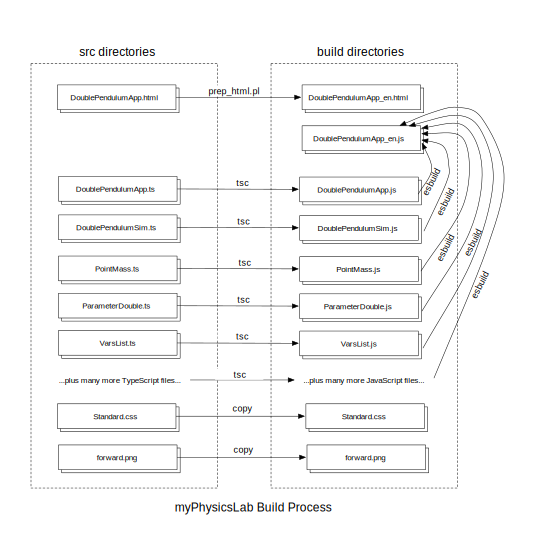

CSS: ./Overview_2.css
Title: Building myPhysicsLab

[Build_Process]: ./Overview_Build_Process.svg

<!-- Copyright 2016 Erik Neumann. All Rights Reserved.
* Use of this source code is governed by the Apache License, Version 2.0.
* See the LICENSE file and http://www.apache.org/licenses/LICENSE-2.0.
-->

[myPhysicsLab Documentation](index.html)

# Building myPhysicsLab Software

[myPhysicsLab](http://www.myphysicslab.com) provides classes to build real-time
interactive animated physics simulations. This page has information about building the
myPhysicsLab software, running tests, internationalization and general programming
issues.

Contents of this page:

+ [License and Source Code][]

+ [Building][]
    + [Build Instructions][]
    + [Customizing The Build Process][]
    + [Building the Documentation][]
    + [Inside the Build Process][]
    + [Directory Structure][]

+ [Testing][]
    + [HTML Example Files][]
    + [Unit Tests][]
    + [Engine2D Tests][]
    + [TestViewerApp][]
    + [Performance Tests][]

+ [Internationalization (i18n)][]
    + [Localized Strings][]
    + [Language Independent Strings][]
    + [How To Set Locale][]
    + [Use only ASCII in Source Code][]
    + [File Naming Convention][]
    + [Separate File Per Locale][]
    + [Language Menu in HTML File][]
    + [What should be localized?][]
    + [What should not be localized?][]

+ [Programming Details][]
    + [Macros in HTML Files][]
    + [Advanced vs. Simple Compile][]
    + [Debugging (running uncompiled)][]
    + [Global Variable Usage][]
    + [Global Namespace Path][]
    + [Exporting Symbols][]
    + [toString() format][]
    + [toStringShort()][]
    + [Programming Style][]
    + [Documentation Guidelines][]
    + [Enums][]

+ [References][]
    + [Closure Compiler References][]
    + [Closure Library References][]
    + [Documentation Tools References][]

Additional information:

+ See [myPhysicsLab Documentation](index.html) for detailed documentation of classes and
    interfaces.
+ See [myPhysicsLab Architecture](Architecture.html) for an introduction to classes
    and interfaces.
+ See [Customizing myPhysicsLab Simulations](Customizing.html) about how to customize
    using only a browser and text editor.
+ See [2D Physics Engine Overview](Engine2D.html)


# License and Source Code

myPhysicsLab is provided as open source software under the
[Apache 2.0 License](http://www.apache.org/licenses/). See the accompanying file
named `LICENSE`.

Source code is available at <http://www.github.com/myphysicslab/myphysicslab>

The [myPhysicsLab](http://www.myphysicslab.com) project was started in 2001 by Erik
Neumann <erikn@myphysicslab.com>. It was originally written in Java, improved and
enhanced over the years and converted to JavaScript from 2013 to 2016.


# Building

## Build Instructions

It is possible to customize a myPhysicsLab simulation without building from
source code, see [Customizing myPhysicsLab Simulations](Customizing.html).

To build from source code the required tools are

+ [Java 7 or higher](www.java.com)

+ [Perl](https://www.perl.org)

+ [GNU Make](https://www.gnu.org/software/make/)

+ [Closure Compiler](https://github.com/google/closure-compiler).

+ [Closure Library](https://github.com/google/closure-library) is a separate
    download from Closure Compiler. It is a collection of JavaScript source
    code.

Once the prerequisites are on your system, follow these steps:

0. Download the myPhysicsLab source code from
    <https://github.com/myphysicslab/myphysicslab>.

2. Copy the file `sampleConfig.mk` to `myConfig.mk` and edit `myConfig.mk` to
    specify location of Closure Compiler in the `CLOSURE_COMPILER` variable.

3. Create a **symbolic link** to `closure-library` in the directory that has
    the `makefile`. Example of how to create the symbolic link:

        $ ln -s ../closure-library/ closure-library

4. Execute `make` at the command line. (Set your directory to where the `makefile` is).
    This will compile all applications and tests in all language versions (using the
    default option `COMPILE_LEVEL=simple`).
    Execute `make help` to see available options.

5.  Open the file `/build/index-en.html` with a browser. This has
    links to all the files that were built.

NOTE: the HTML files in the source directories **cannot be used directly** from
a browser. You must complete the build process first.

See [References][] below for more information on the required tools.


## Customizing The Build Process

Use the command

    make help

to see available targets and options. See comments in the `makefile` for more info.

There are **variables used in `makefile`** which control important aspects of the
build process. These variables have default values which can be overridden in
`myConfig.mk` or via command-line arguments.

+ `COMPILE_LEVEL` - determines whether using [Advanced vs. Simple Compile][] or
    [Debugging (running uncompiled)][]. Examples:

        make COMPILE_LEVEL=advanced
        make COMPILE_LEVEL=simple
        make COMPILE_LEVEL=debug

+ `BUILD_DIR` – location of build directory relative to `makefile` location. The
    `COMPILE_LEVEL` variable determines the default location for `BUILD_DIR` if not
    specified. You can specify `BUILD_DIR` in `myConfig.mk` or at the command line when
    giving the `make` command. Examples:

        make BUILD_DIR=adv-build
        make BUILD_DIR=build
        make BUILD_DIR=debug

+ `LOCALE` – selects which locale to use for [Internationalization (i18n)][], but only
    for single files specified with a shortcut (more about shortcuts below). Examples:

        make doublependulum LOCALE=en
        make doublependulum LOCALE=de
        make doublependulum LOCALE="en de"

    To build all apps for a particular locale use targets `apps-en` or `apps-de`.

+ `GOOG_DEBUG` – turns on the `goog.DEBUG` flag which enables assertions (note that
    assertions are removed under advanced compile). Examples:

        make GOOG_DEBUG=true
        make GOOG_DEBUG=false

+ `UTIL_DEBUG` – turns on the `Util.DEBUG` flag which enables debug code. Examples:

        make UTIL_DEBUG=true
        make UTIL_DEBUG=false

The `makefile` contains **shortcuts for building applications**. For example, instead
of typing:

    make build/sims/pendulum/DoublePendulumApp-en.html

You can just type

    make doublependulum

The shortcut is the name of the application in all lowercase, minus the "app" suffix.
You can add your own shortcuts to your `myConfig.mk`. For example, here is the makefile
instruction that produces the above shortcut:

    doublependulum: $(BUILD_DIR)/sims/pendulum/DoublePendulumApp_$(LOCALE).html

You can combine the above options and shortcuts into a single command, for example:

    make doublependulum COMPILE_LEVEL=advanced LOCALE=de


## Building the Documentation

Building the documentation requires installation of Dossier and MultiMarkdown; see
[References][] for how to obtain these. After installing MultiMarkDown, you should be
able to execute this command:

    multimarkdown -help

To install Dossier follow the build instructions on the
[Dossier website](https://github.com/jleyba/js-dossier). After installing Dossier, you
should be able to execute a command like this (the path to `dossier.jar` is likely to
be different on your system):

    java -jar js-dossier/bazel-bin/src/java/com/github/jsdossier/dossier_deploy.jar --help

Specify the location of `dossier.jar` on your system by
**editing the `DOSSIER` variable** in your version of `myConfig.mk`.

Dossier creates the documentation by compiling all of the source code (Dossier is
actually a custom version of Closure Compiler), and interpreting comments as markdown.
Some Dossier options are specified in the file `dossier_config.json`.

MultiMarkDown is used to create documentation from markdown files such as
`docs/Building.md`, `docs/Architecture.md` and `docs/Engine2D.md`.

All of the documentation can be built with the command

    make docs
    open docs/index.html

The file `docs/index.html` is the **home page** for the documentation, it is built by
Dossier from the `src/docs/doc_start.md` markdown file.

To build only the markdown documentation use the command

    make docs-md

**Diagrams** are mostly created with OmniGraffle `.graffle` source files and output to
`svg` or `pdf` formats, which are stored alongside the source files and copied over to
the docs directory by the `makefile`.

**Papers** written using LaTeX are files ending in `.tex` which produce `.pdf` files by
using the command `pdflatex`. For example

    pdflatex Rigid_Double_Pendulum.tex

will produce the file `Rigid_Double_Pendulum.pdf` as well as some associated files
ending in `.aux`, `.out` and `.log`. Some of these files are needed to figure out
cross-references within the document. Note that you usually have to run `pdflatex` twice
in order to figure out the cross-references.

See [References][] for information about obtaining OmniGraffle and LaTeX.


## Inside the Build Process



This section describes what happens in the build process.

Once the environment has been set up, the `makefile` can handle building any
myPhysicsLab application. The two main transformations are shown in the above diagram.

1. The HTML application file – for example, `DoublePendulumApp.html` – is transformed
    via a perl script `prep_html.pl` to a language specific version –
    `DoublePendulumApp-en.html`– with various text transformations such as
    [internationalization][Internationalization (i18n)].
    The `prep_html.pl` script does macro substitutions (similar to C preprocessor) to
    transform text within the file, writing a new HTML file.  Many of the macros are
    defined in the file `src/macros.html`.

2. The JavaScript application file – for example, `DoublePendulumApp.js` – is compiled
    along with hundreds of other JavaScript files via the bash shell script
    `compile_js.sh` to a single language-specific JavaScript file –
    `DoublePendulumApp-en.js`. The `compile_js.sh` shell script runs the Closure
    Compiler (which is a Java program). The JavaScript application is the "entry
    point"; the compiler finds other JavaScript files to include by examining the
    `goog.require` and `goog.provide` statements in the "entry point" file.

The `makefile` also copies over all the image files in `src/images` to `build/images`
and copies the CSS file `src/stylesheet.css` to `build/stylesheet.css`.

The HTML application files have "next" and "previous" links to make it easy to visit
all of the applications. These links are automatically generated by the macros
`NEXT_LINK` and `PREV_LINK` which use the ordering specified in the file
`src/index_order.txt`. See `prep_html.pl` for more information.

There are "index" files that are essentially a "table of contents" for all the
myPhysicsLab apps. These index files (one for each language such as English and
German) have links to all of the apps. The links should be in the same order as that
given by `src/index_order.txt`.

Note that `sampleConfig.mk` is in the **source code repository** but `myConfig.mk` is
not. This is because `myConfig.mk` is different in each developer's environment,
therefore `myConfig.mk` is excluded from the repository (see the `.gitignore` file).
Similarly, `sampleMachineName.js` is in the source repository, but `MachineName.js` is
excluded because it will be different in each developer's environment.

Some tools are located in directories which can be different on each developer's
system. Their locations are specified as `make` variables (typically in the
`myConfig.mk` file) or via the `closure-library` symbolic link.

+ `CLOSURE_COMPILER` – (`make` variable specified in `myConfig.mk`) Java program that
    compiles Javascript files; typical location is `closure-compiler/build/compiler.jar`

+ `closure-library` – symbolic link to JavaScript files which define classes in the
    `goog` namespaces. Also the Python program `depswriter.py` is located within
    the `closure-library` files, see [Debugging (running uncompiled)][].

+ `DOSSIER` – (`make` variable specified in `myConfig.mk`) Java program that creates
    documentation from Javascript files.


## Directory Structure

For reference, the following describes the purpose and origin of the various files.

+ `myphysicslab` – top-level directory (can be named whatever you like)

    + `adv-build` -- *(generated by `make`)* – Directory created by the command
      `make COMPILE_LEVEL=advanced`. Contents are similar to `build` directory except
      this uses advanced-compile for JavaScript files.

    + `build` – *(generated by `make`)* – Directory created by the command
      `make COMPILE_LEVEL=simple`. Contains compiled applications and HTML files.

        + `images` – contains images used in applications; copy of `src/images/`

        + `index-de.html` – links to all the example HTML applications, German versions

        + `index-en.html` – links to all the example HTML applications, English versions

        + `sims` – contains compiled applications

        + `stylesheet.css` – the stylesheet used by all HTML applications

        + `test` – contains compiled tests

    + `closure-library` – *(created manually)* – a symbolic link to Closure Library
        JavaScript files on your system, see [Build Instructions][].

    + `compile_js.sh` – runs the closure-compiler (which is a Java program)

    + `compile_test.sh` – special compile script for unit tests

    + `debug` – *(generated by `make`)* – Directory created by the command
      `make COMPILE_LEVEL=debug`. Contents are similar to the `build` directory, except
      this contains only HTML files, no JavaScript.
      See [Debugging (running uncompiled)][].

        + `deps.js` contains dependency information from `goog.require` and
          `goog.provide` statements in a single file; needed only when running from
          uncompiled source code.

    + `docs` – *(generated by `make`)* – Contains documentation built from source code.

    + `dossier_config.json` – specifies options for Dossier documentation

    + `LICENSE` – contains license information

    + `MachineName.js` – *(created manually)* – if present it defines the global
        property `MYPHYSICSLAB_MACHINE_NAME` which is used to find expected times in
        [Performance Tests][].

    + `makefile` – the instructions used by `make`

    + `myConfig.mk` – *(created manually)* – Specifies information that is unique to
       your development environment, such as where tools are located, build options,
       etc. **Create this manually, by copying from `sampleConfig.mk`**
       see [Build Instructions][].

    + `prep_html.pl` – transforms the HTML files into language-specific compiled
        versions, and does macro substitutions.

    + `README.md` – Project information

    + `sampleConfig.mk` – sample version of `myConfig.mk`.

    + `sampleMachineName.js` – sample version of `MachineName.js`.

    + `src` – contains source code

        + `docs` – contains source for documentation

            + `doc_start.md` Dossier transforms this to be the documentation
                "home page" file `docs/index.html`

        + `images` – image files for user interface controls

        + `index_order.txt` – lists the example HTML applications in order, used to
            create the "next" and "previous" links in HTML files

        + `index.html` – links to all the example HTML applications

        + `lab` – source code directory for myPhysicsLab library code

        + `macros_tab.html` – defines text substitution macros, used for tab layout

        + `macros_vert.html` – defines text substitution macros, used for vertical
           layout

        + `macros.html` – defines text substitution macros, used in all HTML files

        + `sims` – source code directory for myPhysicsLab simulations and applications

        + `test` – source code directory for myPhysicsLab tests and test viewers

The `make` variable `BUILD_DIR` specifies where to put compiled code, see
[Customizing The Build Process][].


# Testing

## HTML Example Files

The [HTML Example Files](http://www.myphysicslab.com/develop/build/index-en.html) are
for developer testing, not meant to be finished web pages.

The HTML files in the source directories **cannot be used directly** from
a browser. You must complete the build process first.

The command to build the HTML Example Files is

    make
    open build/index-en.html

The "home page" for the examples is `src/index.html`. It lists all the examples for
quick access. The examples are linked together via **"next" and "previous" links** on
each page to easily view all the examples. Clicking on the myPhysicsLab logo on any
page takes you back to the examples "home page".

After compiling, there will be a "home page" **version for each locale** such as
`index-en.html` and `index-de.html`.

To build only the English versions of all the apps use this command:

    make apps-en
    open build/index-en.html

To build only the German versions:

    make apps-de
    open build/index-de.html

To make [advanced-compiled versions][Advanced vs. Simple Compile] of all apps:

    make COMPILE_LEVEL=advanced
    open adv-build/index-en.html

To make [debug versions][Debugging (running uncompiled)] of all apps:

    make COMPILE_LEVEL=debug
    open debug/index-en.html

The "next" and "previous" links on each example page are generated by the
`prep_html.pl` perl script, which gets the order by reading the file
`src/index_order.txt`.

Each application has two components:

1. An HTML file that is opened in a browser and loads the JavaScript application.
    This is typically named with the suffix `App.html` in the source files,
    for example `DoublePendulumApp.html`.

2. The JavaScript file containing the application code. This is typically built from
    a source file with the suffix `App.js`, for example `DoublePendulumApp.js`.
    That file will include many other JavaScript files, but after compilation they are
    all combined to a single JavaScript file.

When adding a new application follow these steps:

1. Add the application to the list in `makefile` so that it is built as part of the
    `make all` command.

2. Add the application to the list in `src/index_order.txt`.

3. Add a link to the application in `src/index.html`.

4. Execute `make all` to ensure all the "next/previous" links are remade in other
    web pages that link to the new page.


## Unit Tests

These are commands that will build and run the unit tests using various options for
compilation level and locale:

+ English simple-compiled unit tests

        make unittest
        open build/test/UnitTest-en.html

+ German simple-compiled unit tests

        make unittest LOCALE=de
        open build/test/UnitTest-de.html

+ English debug-compiled unit tests

        make unittest COMPILE_LEVEL=debug
        open debug/test/UnitTest-en.html

+ German debug-compiled unit tests

        make unittest COMPILE_LEVEL=debug LOCALE=de
        open debug/test/UnitTest-de.html

+ English advanced-compiled unit tests

        make unittest COMPILE_LEVEL=advanced
        open adv-build/test/UnitTest-en.html

Unit tests are compiled with a special shell script named `compile_test.sh`. See
instructions there about adding new unit tests.

Unit tests are contained in `/test` subdirectories of many namespaces, for example in
`myphysicslab.lab.util.test`. By convention, the file name of these unit tests end with
the word `_test`.

The `goog.testing.jsunit` library is used to run the unit tests. See documentation
about using `jsunit` in [*Closure: The Definitive Guide* by Michael Bolin][References].

Each unit test must be stored in a global function whose name begins with the word
`test`. This is required for the test to be automatically found and run by `jsunit`.
It is necessary to [export test names][Exporting Symbols] when using advanced-compile.

To debug a unit test more easily, run it uncompiled, see
[Debugging (running uncompiled)][]. The error messages will then refer to line numbers
in source files, which are far easier to interpret than line numbers in a compiled file.

*Note that the unit test coverage is far from complete!*


## Engine2D Tests

[Engine2DTests](myphysicslab.test.Engine2DTests.html) are a set of tests of the
`myphysicslab.lab.engine2D` namespace. These tests do *not* use `jsunit`, instead they
use [Engine2DTestRig](myphysicslab.test.Engine2DTestRig.html) to run the tests.

To run simple-compiled engine2D tests execute the commands

    make test COMPILE_LEVEL=simple
    open build/test/Engine2DTests-en.html

To run advanced-compiled engine2D tests execute the commands

    make test COMPILE_LEVEL=advanced
    open adv-build/test/Engine2DTests-en.html

To debug engine2D tests see [Debugging (running uncompiled)][] and execute
the commands

    make test COMPILE_LEVEL=debug
    open debug/test/Engine2DTests-en.html

The engine2D tests will run the simulation, usually
[ContactSim](myphysicslab.test.ContactSim.html), without any user interface view or
controller. A typical test will create the simulation, set up initial conditions, run
the simulation for a set amount of time, and then analyze the resulting simulation
state. Typically the simulation variables are compared to a pre-computed "good" state.
Also the energy of the simulation might be tested in some way; for example the energy
of a system might be expected to be constant.

When changes are made to the `myphysicslab.lab.engine2D` simulation engine it is
possible that the *expected results* for tests need to be modified. Changing the
expected results should be avoided unless you are sure that the changes you've made are
correct.

[SingleTest](myphysicslab.test.SingleTest.html) runs a single test and is useful
for debugging a test.


## TestViewerApp

[TestViewerApp](myphysicslab.test.TestViewerApp.html) is an application that
provides the ability to interactively run the tests found in
[Engine2DTests](myphysicslab.test.Engine2DTests.html).
This is useful to ensure that the tests are functioning as designed, and for debugging.

To run simple-compiled TestViewerApp execute the commands

    make testviewer COMPILE_LEVEL=simple
    open build/test/TestViewer-en.html

To run advanced-compiled TestViewerApp execute the commands

    make testviewer COMPILE_LEVEL=advanced
    open adv-build/test/TestViewer-en.html

To debug TestViewerApp, see [Debugging (running uncompiled)][]
and execute the commands

    make testviewer COMPILE_LEVEL=debug
    open debug/test/TestViewer-en.html

TestViewerApp has a set of menus for selecting which test to run. It looks for global
functions whose name ends `_setup` and includes those in the menus. Therefore these
`_setup` functions must be exported, see [Exporting Symbols][].

TestViewerApp only does the *setup* portion of the test, it won't check the test
results. It is useful for understanding what a test is doing, and in some cases for
debugging a test.

Note that subtle differences can occur in TestViewerApp which can make the results
different from when tests are run by Engine2DTestRig. There are many options available
with ContactSim, so you need to be careful to make sure they are the same in both
places when debugging.  The state of the
[random number generator](myphysicslab.lab.util.RandomLCG.html) is particularly
important; the test setup function should set the seed of the random number generaotor
for this reason.


## Performance Tests

[PerformanceTests](myphysicslab.test.PerformanceTests.html) runs a small set of
performance tests of the `myphysicslab.lab.engine2D` namespace. These tests are similar
to those of Engine2DTests: they are run with Engine2DTestRig (*not* with `jsunit`).

**Copy the file `sampleMachineName.js`** to `MachineName.js` and edit the file to have a
unique name for your development machine.

To run uncompiled engine2D performance tests see [Debugging (running uncompiled)][]
and execute the commands

    make perf COMPILE_LEVEL=debug
    open debug/test/PerformanceTests-en.html

To run simple-compiled engine2D performance tests execute the commands

    make perf COMPILE_LEVEL=simple
    open build/test/PerformanceTests-en.html

To run advanced-compiled engine2D performance tests execute the commands

    make perf COMPILE_LEVEL=advanced
    open adv-build/test/PerformanceTests-en.html

A performance test gets an **expected time limit** from global properties defined in
`src/test/ExpectedPerf.js`. Each combination of test, browser, and machine has a
different expected time limit. The test passes if the time to run the test is near the
expected time.

Because *performance is different on each browser and machine*, each computer that the
performance test is run on should be given a **unique machine name** which is specified
in the file `MachineName.js`. This `MachineName.js` file is not checked in to the
source repository because it is different on each machine. There is a file
`sampleMachineName.js` which can be copied and modified to specify the unique machine
name.

The file `src/test/ExpectedPerf.js` *is checked in to the repository* so that we can
then compare running times across various browsers and machines.

If the file `src/test/MachineName.js` doesn't exist, then the performance test will
still run and report the how long each test took, but the tests will all pass because
the default expected time is very long (10000 seconds).


# Internationalization (i18n)

This section explains programming details concerning internationalization (i18n).


## How To Set Locale

To set the locale when building an application, set the `LOCALE` variable during the
`make` process; see [Customizing The Build Process][].

The
[ISO 639-1 language code](http://www.loc.gov/standards/iso639-2/php/English_list.php)
is a two-letter lowercase code. For example, English is `en`, and German is `de`. The
Closure Library property `goog.LOCALE` stores this language code. `goog.LOCALE` is a
constant so that under [advanced-compile mode][Advanced vs. Simple Compile] the other
language strings are not included in the compiled version.

The `goog.LOCALE` symbol is set as part of the compilation process by giving the
compiler option `define=goog.LOCALE='de'`. The `makefile` does this automatically
depending on what file is requested to be built, see [Customizing The Build Process][].

When [Debugging (running uncompiled)][], you can add a `goog.define` command to the
HTML file like this:

    <script>
    goog.define('goog.LOCALE', 'de');
    goog.require('myphysicslab.sims.pendulum.DoublePendulumApp');
    </script>


## Localized Strings

Most classes have a static `i18n` property where localized strings are stored. Strings
are defined in versions for each supported language. The localized strings are found at
the end of a class file. Here is an example with English and German:

    /** Set of internationalized strings.
    @typedef {{
      TIME_STEP: string,
      DISPLAY_PERIOD: string
      }}
    */
    SimRunner.i18n_strings;

    SimRunner.en = {
      TIME_STEP: 'time step',
      DISPLAY_PERIOD: 'display period'
    };

    SimRunner.de_strings = {
      TIME_STEP: 'Zeitschritt',
      DISPLAY_PERIOD: 'Bild Dauer'
    };

    SimRunner.i18n = goog.LOCALE === 'de' ? SimRunner.de_strings :
        SimRunner.en;

Code that refers to `SimRunner.i18n.TIME_STEP` will use the localized version of that
string in the current locale.


## Language Independent Strings

For scripting purposes it is often necessary to have a language independent string,
so that a script can work regardless of the current locale. A language independent
string is **derived from the English version** of the string by running it through
the function
[Util.toName()](myphysicslab.lab.util.Util.html#Util.toName)
which turns the name into all caps and replaces spaces and dashes with underscores. For
example:

    Util.toName('time step')

will return `'TIME_STEP'`. Equivalently, you can use the property name:

    Util.toName(SimRunner.en.TIME_STEP);

Many methods that deal with finding objects by name will do the `toName()` conversion
automatically. For example, in the following code fragment, the
[VarsList.getVariable()](myphysicslab.lab.model.VarsList.html#getVariable) method
converts the input argument string `'angle-1'` to the language independent form
`'ANGLE_1'`:

    vars = sim.getVarsList();
    var angle = vars.getVariable('angle-1');
    angle.setValue(Math.PI/4);

Other methods that convert an input string argument to a language independent version
include:

+ [SimObject.nameEquals()](myphysicslab.lab.model.SimObject.html#nameEquals)

+ [SubjectEvent.nameEquals()](myphysicslab.lab.util.SubjectEvent.html#nameEquals) This
    is inherited by `Parameter` and `Variable` as well.

+ [ParametricPath.nameEquals()](myphysicslab.lab.model.ParametricPath.html#nameEquals)

+ [DiffEqSolver.nameEquals()](myphysicslab.lab.model.DiffEqSolver.html#nameEquals)

+ [RigidBodySim.getBody()](myphysicslab.lab.engine2D.RigidBodySim.html#getBody)

+ [Subject.getParameter()](myphysicslab.lab.util.Subject.html#getParameter)

+ [VarsList.getVariable()](myphysicslab.lab.model.VarsList.html#getVariable)

Using the above methods helps avoid errors like the following from `RigidBodyRollerApp`:

    if (this.path.getName() == CirclePath.en.NAME) {

That comparison won't work because `NumericalPath.getName()` returns the
language-independent version of the name which is not the same as the English version.
There are two ways to fix this:

    if (this.path.getName() == Util.toName(CirclePath.en.NAME)) {

or:

    if (this.path.nameEquals(CirclePath.en.NAME)) {


## Use only ASCII in Source Code

Use only ASCII characters in source code for localized strings. Unicode characters
should use the `\uxxxx` encoding. For example, here are some frequently used German
characters:

+ &szlig; = esszet `= \u00df`
+ &auml; = umlaut-a `= \u00e4`
+ &ouml; = umlaut-o `= \u00f6`
+ &uuml; = umlaut-u `= \u00fc`

The Java utility `native2ascii` can be helpful for converting between native-encoded
and ASCII-Unicode.

## File Naming Convention

Compilation with Closure Compiler results in a JavaScript file that is targeted for a particular locale, depending on the setting of `goog.LOCALE`. The HTML web
page decides which localized compiled version to load.

This is reflected in the *file naming convention*.
The **last characters of a file name specify the locale**, for example
`DoublePendulumApp-en.html` is the English version which loads
`DoublePendulumApp-en.js`, whereas `DoublePendulumApp-de.html` is the German version
which loads `DoublePendulumApp-de.js`.

The `makefile` handles the details about how to produce the desired localized version,
you only have to tell it the name of the file you want to build, and the `makefile`
figures out what the locale is from the requested filename. For example, the command

    make build/sims/pendulum/DoublePendulumApp-de.html

results in the German version of the JavaScript and HTML files being made.
Equivalently, you can use the shortcut name and specify the locale like this:

    make doublependulum LOCALE=de

See [Customizing The Build Process][].

## Separate File Per Locale

This approach of having a **separate file for each locale** is recommended in the book
[*Closure: The Definitive Guide*][References] by Michael Bolin:

>In the Closure Library, the intended technique for doing i18n is for the Compiler to
>produce one JavaScript file per locale with the translations for the respective locale
>baked into the file. This differs from other schemes, in which there is one file per
>locale that contains only translated messages assigned to variables and one JavaScript
>file with the bulk of the application logic that uses the message variables.
>Implementing the “two file” approach is also an option for doing i18n in the Closure
>Library today: the file with the translated messages should redefine goog.getMsg() as
>follows:

    // File with application logic:
    var MSG_HELLO_WORLD = goog.getMsg('hello world');

    // File with translations:
    goog.getMsg = function(str, values) {
      switch (str) {
        case 'hello world': return 'hola mundo';
        default: throw Error('No translation for: ' + str);
      }
    };

>The Compiler is not designed for the “two file” scheme because the “single file” scheme
>results in less JavaScript for the user to download. The drawback is that locales
> cannot be changed at runtime in the application (note how Google applications, such as
> Gmail, reload themselves if the user changes her locale setting), but this is fairly
> infrequent and is considered a reasonable trade-off.

>*From Closure: The Definitive Guide, by Michael Bolin, p. 67.*

The code size savings only happen with
[ADVANCED compilation][Advanced vs. Simple Compile] which removes dead code. When
myPhysicsLab is compiled with SIMPLE compilation – which is necessary to use some types
of [scripting](Customizing.html) – then there are no savings of code size, in fact all
the strings for each locale are included, but only one set of locale strings are used.

Nonetheless, it is still most practical to **regard the locale as fixed** when the web
page loads so that we don't have to rebuild or modify user interface controls when
switching locale. Plus we may want to provide translated text on the web page itself,
which usually requires having a separate web page per locale.


## Language Menu in HTML File

The scheme of naming HTML and JavaScript files for a particular locale is seen in how
the language menu operates in the HTML files for the various applications. For example
in the compiled version `DoublePendulumApp-en.html` there is code like this:

    <select id='language_menu'
      onchange='location = this.options[this.selectedIndex].value;'>
      <option value='DoublePendulumApp-en.html' selected>
        English
      </option>
      <option value='DoublePendulumApp-de.html' >
        German
      </option>
    </select>

That creates a menu for selecting the current locale; selecting the German option would
load the file `DoublePendulumApp-de.html`.


## What should be localized?

Names that are visible to users should be localized. This includes:

+ Parameters. These are often visible as user interface controls.

+ Variables. These appear in the pop-up menus for graphs.

+ User interface controls, such as NumericControl, ChoiceControl, CheckBoxControl.

+ Polygon names. These are used to generate variable names in RigidBodySim.

## What should not be localized?

Some names are not seen by the user, they are only used for scripting so they only have
language-independent names. These include:

+ GenericEvent names

+ Subject names

+ SimObject names other than Polygon (because not used for generating variable names)

For example in [SimList](myphysicslab.lab.model.SimList.html) there are GenericEvents
that occur when objects are added or removed; SimList defines only language independent
names for these:

    SimList.OBJECT_ADDED = 'OBJECT_ADDED';
    SimList.OBJECT_REMOVED = 'OBJECT_REMOVED';

Using the static property reference `SimList.OBJECT_ADDED` rather than the literal
string 'OBJECT_ADDED' will result in smaller code under advanced-compile and will
remain correct in case the string is ever changed.


# Programming Details


## Macros in HTML Files

The reason that the HTML files in the source directories **cannot be used directly**
from a browser is that they contain macros (or "templates") which must be expanded to
become proper HTML.

When you look at the [Start-Up HTML Files](Architecture.html#start-uphtmlfile) for
applications, you will notice a mix of regular HTML and macros. The macros are the
words starting with a hash-tag. for example:

    #define #TOP_DIR ../..
    #define #APP_PATH sims.pendulum.PendulumApp
    #include "#TOP_DIR/macros.html"
    #include "#TOP_DIR/macros_tab.html"
    #DOC_TYPE
    <html lang="en">
    <head>
    #META_TAGS
    #HIDE_ALL
    </head>
    <body>
    #SITE_LOGO
    <h1>#APP_PATH #DEBUG_STATUS</h1>
    #HEADER_BAR
    #CONTROLS_CONTAINER

During the build process, the `.html` file undergoes text manipulation to expand macro
definitions (roughly similar to macros in the C preprocessor). The expanded version is
written to a **new file** in the build directory.

The text manipulation is done with a **perl script called `prep_html.pl`**. That perl
script interprets text-replacement rules defined in the `macros.html` and
`macros_tab.html` files in the above example.

See the documentation at the start of `prep_html.pl` for more information.


## Advanced vs. Simple Compile

Google [Closure Compiler][References] is used to compile the myPhysicsLab code.
Closure Compiler has many options, but the most important is the
[`compilation_level`](https://developers.google.com/closure/compiler/docs/compilation_levels)
which can be set to:

1. **WHITESPACE_ONLY** removes comments and whitespace (this level is rarely used).

2. **SIMPLE**  minimizes local variables; removes comments and whitespace.

3. **ADVANCED** minimizes all code that is not global or [exported][Exporting Symbols];
    removes "dead code" that can never be reached from the entry point of the program;
    rewrites code to logically equivalent but shorter versions in many cases.

*Minimize* means that names of functions, variables, classes, interfaces, etc. are
renamed to very short names. Another term for *minimization* is *obfuscation* because
the resulting code is unreadable by humans. Here is an example of how code looks after
advanced-compile:

    function vc(a,b){return new I(a.h+(b.M()-a.f)/a.a,a.g+(a.c-(b.K()+b.D()))/
    a.b,a.h+(b.M()+b.G()-a.f)/a.a,a.g+(a.c -b.K())/a.b)}function wc(a,b){return new
    H(J(a,b.u()),xc(a,b.s()))}function J(a,b){return a.f+(b-a.h)*a.a}function
    xc(a,b){return a.c-(b-a.g)*a.b};

The main advantage of advanced-compile is that the resulting code is **smaller** –
about 20% of the size compared to simple-compile. As a result, page load time is much
faster: from roughly 3 seconds with simple-compile to 0.5 second with advanced-compile.

The main disadvantage of advanced-compile is that we **cannot use JavaScript scripts**
to customize a simulation at runtime. See
[Customizing myPhysicsLab Simulations](Customizing.html) and
[Advanced-compile is the Enemy of JavaScript](myphysicslab.lab.util.Terminal.html#advanced-compileistheenemyofjavascript).

The myPhysicsLab `makefile` has a variable named `COMPILE_LEVEL` that determines which
compilation level is used. `COMPILE_LEVEL` also determines the value of `BUILD_DIR` –
what directory the resulting files are output to (if `BUILD_DIR` is not already set).
`COMPILE_LEVEL` can be set to:

+ `COMPILE_LEVEL=advanced` also sets `BUILD_DIR=adv-build`
+ `COMPILE_LEVEL=simple` also sets `BUILD_DIR=build`
+ `COMPILE_LEVEL=debug` also sets `BUILD_DIR=debug`. Creates the HTML file that runs
    from source code, see [Debugging (running uncompiled)][]

The [Util.ADVANCED](myphysicslab.lab.util.Util.html#ADVANCED) flag is set
to `true` when advanced-compile is used. This flag is mostly used to avoid defining
`toString` functions under advanced-compile.

See the following pages for more information about Closure Compiler:

+ [Closure Compiler Compilation Levels](https://developers.google.com/closure/compiler/docs/compilation_levels)
    explains simple and advanced compilation

+ [Advanced Compilation and Externs](https://developers.google.com/closure/compiler/docs/api-tutorial3)
    explains problems to watch for with advanced compilation


## Debugging (running uncompiled)

It is possible to run myPhysicsLab simulations from
**uncompiled JavaScript source code** which makes debugging easier. Running from
source code preserves line numbers and symbols which makes error messages and stack
traces easy to interpret.

In contrast, advanced-compiled code is very difficult to interpret because of
minimization of symbols. Even simple-compiled code is concatenated into very long lines
that don't correspond to the source code, and local variable names are minimized.

[Python 2.7](https://www.python.org) or above is required in order to create the
`deps.js` file. The `deps.js` file is created automatically by the `makefile` when you
specify `COMPILE_LEVEL=debug`. It is created by using the
[depswriter.py](https://developers.google.com/closure/library/docs/depswriter) tool
which is supplied in [Closure Library][Closure Library References].


To run, for example, [DoubleSpringApp](myphysicslab.sims.springs.DoubleSpringApp.html)
from source code:

    make doublespring COMPILE_LEVEL=debug
    open debug/sims/springs/DoubleSpringApp-en.html

The rest of this section gives more details about how the process of running from
source code works.

Running from uncompiled source code requires a different way of loading the Google
Closure Library and the myPhysicsLab code. This is why the start-up HTML file is very
different in the uncompiled case versus the compiled case.

+ For **compiled code**, the JavaScript code from many source files is compiled into a
    single JavaScript file. The start-up HTML file loads the compiled JavaScript code
    with a script like this:

        <script src='DoubleSpringApp-en.js'></script>

    The compiled code *defines* the classes needed for the application, it does not
    instantiate the application and start it running.
    See [Start-Up HTML File](Architecture.html#start-uphtmlfile) for more information.


+ For **uncompiled code**, the start-up HTML file calls Closure Library file `base.js`,
    and also a dependency file `deps.js` which tells for each class where to find it's
    source code and what its required classes are. Then the class of interest is loaded
    with a `goog.require` statement (which causes a cascade of all other needed classes
    to be loaded first). Here is an example from
    `debug/sims/springs/DoubleSpringApp-de.html`:

        <script src='../../../closure-library/closure/goog/base.js'></script>
        <script src='../../deps.js'></script>
        <script>
          goog.define('goog.LOCALE', 'de');
          goog.define('goog.DEBUG', true);
          goog.require('myphysicslab.sims.springs.DoubleSpringApp');
        </script>

Note that `closure-library` is a symbolic link to wherever Closure Library is on your
system, see [Build Instructions][].

Setting `goog.LOCALE` (seen in the script above) is optional, if you leave that out
then the default locale will be used. Similarly for `goog.DEBUG`, setting it is
optional.

See also:
[Debugging Uncompiled Source Code](https://github.com/google/closure-compiler/wiki/Debugging-Uncompiled-Source-Code).


## Global Variable Usage

myPhysicsLab applications are written to
**minimize the number of global variables created**. For most applications there are
only four global variables created:

+ **`myphysicslab`** is the root object of the myPhysicsLab namespace which contains
    the definitions of all the classes needed for the given application. For example,
    in a simple-optimized application, you can find the constructor
    `myphysicslab.lab.model.GravityLaw` at the end of a chain of properties starting
    with the `myphysicslab` object.

+ **`app`** is the application that has been instantiated (the symbol `app`
    can vary). It will typically have properties for its simulation, canvas, and many
    other objects. For example, you can reference the simulation as `app.sim` in many
    cases. Storing the application object in a global variable ensures that it and
    anything it refers to will not be garbage collected.

+ **`goog`** is the global namespace object holding the Closure Library.

+ **`COMPILED`** is created by the Closure Library, it indicates that the code
    has been compiled.

Of these, only `app` can be renamed to avoid conflicts with other namespaces.

There is an additional global variable for the current machine name but this is only
needed for [Performance Tests][].


## Global Namespace Path

Each object must be accessible from the global namespace, otherwise it is garbage
collected. Conversely, to free an object we simply erase any references to it that are
visible from the global namespace. In JavaScript, global variables are properties of
the window object.

The myPhysicsLab classes are accessible via the `myphysicslab` global variable. Object
instances are accessible via the application object, often stored in the global variable
called `app`.

Classes are grouped into *namespaces* by a naming convention. For example, the class
PointMass is in the namespace `myphysicslab.lab.model`. These namespace names are
actual JavaScript objects which you can examine directly, as in this
[Terminal](Customizing.html#terminal:forscriptexecution) session:

    myphysicslab
    // [object Object]
    propertiesOf(myphysicslab)
    // lab,sims
    propertiesOf(myphysicslab.lab)
    // app,controls,graph,model,util,view
    propertiesOf(myphysicslab.lab.model)
    // CoordType,ShapeType
    methodsOf(myphysicslab.lab.model)
    // AbstractMassObject,AbstractODESim,AbstractSimObject,AdaptiveStepSolver,
        AdvanceStrategy,Arc,ConcreteLine,ConcreteVariable,DiffEqSolver,
        DiffEqSolverSubject,EnergyInfo,EnergySystem,EulersMethod,ExpressionVariable,
        Force,ForceLaw,Line,MassObject,ModifiedEuler,ODEAdvance,ODESim,PointMass,
        RungeKutta,SimList,SimObject,SimpleAdvance,Simulation,Spring,Variable,VarsList
    propertiesOf(myphysicslab.sims)
    // layout,springs
    methodsOf(myphysicslab.sims.springs)
    // SingleSpringApp,SingleSpringSim

Note that the list of objects shown is a small subset of what is available.
This is because the compilation process selects which classes
are needed and only includes those. The above session was run within the
SingleSpringApp simulation compiled with simple-compile, so only the classes needed by
that simulation have been
included. This process of selecting which classes are needed is governed by the
**`goog.provide` and `goog.require`**
statements that are at the top of each source code file.

The namespace path symbols are subject to minimization when advance-compiled. To avoid
minimization of symbols see [Exporting Symbols][] below.


## Exporting Symbols

[Advanced-compilation][Advanced vs. Simple Compile] minimizes names of any objects that
are not global variables (in JavaScript a global is a property of the `window` object).
For example, `myphysicslab.lab.model.PointMass` will become something like
`myphysicslab.g.s.a3` when advance-compiled.

Under advanced-compilation, you can specify that a symbol should be **exported**, and
then the entire pathname of that object will remain intact.

Exporting can be done in two ways:

1. An `@export` tag is added to the comments of a method or property; the compiler
    interprets this and the symbol not minimized.

2. Use the Closure Library functions `goog.exportSymbol` or
    `goog.exportProperty` to specify symbols that should not be minimized.

The main usage of exporting symbols in myPhysicsLab is:

+ for an application's constructor, so that it can be instantiated from HTML scripts
    when advanced-compiled.
    See [Start-Up HTML File](Architecture.html#start-uphtmlfile).

+ for certain application methods such as `setup`, `start`, `eval` which are called
    from the start-up HTML file.

+ in [Unit Tests][], so that the tests can be executed when advanced-compiled (the
    jsunit framework looks for functions whose name starts with "test").

+ in [Engine2D Tests][], the functions whose name ends with '_setup' are added to the
    list of tests that can be run in [TestViewerApp][], even when advanced-compiled.

Exporting symbols has no effect with simple-compiled programs.

See [Advanced Compilation and Externs](https://developers.google.com/closure/compiler/docs/api-tutorial3)
for discussion of when and how to export symbols.


## toString() format

The `toString()` method should print a format that looks somewhat
**like a JavaScript object literal** preceded by the name of the class. Here is an
example of a [PointMass](myphysicslab.lab.model.PointMass.html) object; note that there
are nested Vector objects inside it.

    PointMass{
      name_: "BLOCK",
      expireTime_: Infinity,
      mass_: 0.5,
      loc_world_: Vector{
        x: -0.72021,
        y: 0
      },
      angle_: 0,
      velocity_: Vector{
        x: 4.38584,
        y: 0
      },
      angular_velocity_: 0,
      cm_body_: Vector{
        x: 0,
        y: 0
      },
      zeroEnergyLevel_: null,
      moment_: 0,
      shape_: 1,
      width_: 0.4,
      height_: 0.8
    }
The indentation shown above is done automatically by the function
[Util.prettyPrint](myphysicslab.lab.util.Util.html#Util.prettyPrint).
Without pretty-printing, the above output of `toString()` looks like this:

    PointMass{name_: "BLOCK", expireTime_: Infinity, mass_: 0.5, loc_world_: Vector{x:
    -0.72021, y: 0}, angle_: 0, velocity_: Vector{x: 4.38584, y: 0}, angular_velocity_:
    0, cm_body_: Vector{x: 0, y: 0}, zeroEnergyLevel_: null, moment_: 0, shape_: 1,
    width_: 0.4, height_: 0.8}

The `toString()` method should be wrapped in an `if (!Util.ADVANCED)`
statement that disables the code under advanced-compile.


## toStringShort()

There is an alternate version of `toString()` called `toStringShort()` which prints
**minimal identifying information** for the object, often just the class name and the
name of the object. Many myPhysicsLab classes implement the
[Printable](myphysicslab.lab.util.Printable.html) interface which specifies
the `toStringShort()` method. There are two reasons for using the `toStringShort()`
method:

1. **avoids infinite loops** There can be circular references between objects – if a
    `toString()` method calls `toString()` on another object an infinite loop could
    occur. The `toStringShort()` method is safe because it never lists any sub-objects.

2. **makes `toString()` output more readable** When an object has another sub-object as
    a property it may be important to show the sub-object, but a full `toString()`
    printout of the sub-object can result in too much output and distracts from showing
    the object.

Here is a pretty-printed example showing an array-like object where each member of the
array is printed using `toStringShort()`

    SimList{
      name_: "SIM_LIST",
      length: 3,
      tolerance_: 0.1,
      elements_: [
        PointMass{name_: "BLOCK"},
        PointMass{name_: "FIXED_POINT"},
        Spring{name_: "SPRING"}
      ],
      parameters: [
      ],
      observers: [
      ]
    }


## Programming Style

See [Google JavaScript Style Guide](https://google.github.io/styleguide/javascriptguide.xml);
those style guidelines are mostly followed by myPhysicsLab code.

+ Prefer single quotes for strings.

+ Indentation is 2 spaces.

+ Continued lines are indented 4 spaces from the line it continues.

+ [Use only ASCII in Source Code][]

+ Private and protected property names should end with a trailing underscore.

+ Use markdown in comments.  See [Documentation Tools References][] about `Dossier`
    and `CommonMark`. HTML tags can be
    used as well, for example `` and `<pre>` tags.

+ Each class should have a `toString()` method wrapped in an

        if (!Util.ADVANCED) { }

    statement that disables the code under advanced-compile. The `toString` method
    should appear right after the constructor.

+ The `toString()` method should list actual property names, so that those
    properties can be easily examined in Terminal or console.

The order of items in a JavaScript source code file is as follows:

+ `goog.provide` and `goog.require` statements

+ `goog.scope` shortcuts

+ Constructor.  The comment for the constructor is the summary documentation
    for the class.

+ `toString` and `toStringShort` methods

+ Static class properties and types, in alphabetic order. Also static factory methods
    (which create instances of the class).

+ Functions (methods), in alphabetic order within a file. Static and instance methods
    are mixed together, except for static factory methods. (Instance methods have
    `prototype` in the name, static methods don't.)

+ Internationalized strings. The typedef `i18n_strings` comes first, then the English
    version (because it is public and is the basis of the language independent
    names), then other languages in alphabetic order.

There are exceptions to keeping things in alphabetic order when a different order makes
the code more readable.


## Documentation Guidelines

Every public class, interface, method, function, enum, etc. should have documentation.
Use markdown, following examples found in the code.

Note that there are **two flavors of markdown** in use depending on whether the
documentation is in JavaScript code or is in a markdown `.md` file, see [Documentation Tools References][].
In particular, the way to write hyperlinks differs between these.

Here are general documentation guidelines:

1. The first line should be a summary of what the class/interface/function does.

2. The first paragraph should give the gist of what the class does:
    a quick-to-read summary.

3. Document what is relevant to a user of the class, rather than details
    about how the class works internally.

4. Code examples and diagrams are helpful.

5. Use section headings to group concepts.

6. Supply links to relevant classes, to functions within the class, or to other docs.


## Enums

The following describes how enums are defined and used in myphysicslab. This is based on
how closure compiler defines enums, see [Closure Compiler References][] for more
information.

The reasons to use an enum include:

+ an enum activates compile-time checking, which ensures that only valid enum values
    are used.

+ an enum provides documentation and clarity about the meaning of the enum values.

+ an enum can define the set of allowed values and the corresponding set of "choice"
    strings that can be used in a user interface menu.

Here is an example enum, for which the underlying type is *string*:

```
/** DrawingMode enum, specifies how the line of a graph is drawn.
* @enum {string}
*/
myphysicslab.lab.view.DrawingMode = {
  DOTS: 'dots',
  LINES: 'lines'
};
```
An enum can take several forms:

+ the enum value, for example `myphysicslab.lab.view.DrawingMode.DOTS`

+ the underlying string or numeric value, for example 'dots'

+ a localized choice string; for example 'Dots' or 'Punkte' depending on the current
    language

The standard names for converting among these forms is

+ `stringToEnum` or `numberToEnum`
+ `choiceToEnum`
+ `enumToChoice`

Because an enum can be used as its underlying type there is no `enumToNumber` or
`enumToString`.

An enum value can be used as its underlying type (string, number, or boolean), but to
go the other way you must use a function like `numberToEnum` or `stringToEnum`. Think of
it like this:

+ every enum value has a certain underlying value (a string, number, or boolean)

+ not every string, number, or boolean corresponds to a valid enum


In myPhysicsLab, some enums also define functions that return the set of valid
enum values:

+ `getValues` returns the set of valid enums.

+ `getChoices` returns the localized string versions of the enums in `getValues`.

Those are used to define the allowed set of choices and values for a
[ParameterString](myphysicslab.lab.util.ParameterString.html)
or [ParameterNumber](myphysicslab.lab.util.ParameterNumber.html),
which can then present a menu to the user with a
[ChoiceControl](myphysicslab.lab.controls.ChoiceControl.html).


# References


## Closure Compiler References

[Annotating JavaScript for the Closure Compiler](https://github.com/google/closure-compiler/wiki/Annotating-JavaScript-for-the-Closure-Compiler)
lists tags and type expressions that Closure Compiler understands.

[Closure: The Definitive Guide](http://shop.oreilly.com/product/0636920001416.do) by
Michael Bolin, O'Reilly Publishing, Sept 2010; is essential reading – still the best
introduction and reference for using Closure Compiler and Closure Library. Published in
2010 it is out of date in some details.

[Closure Compiler on github](https://github.com/google/closure-compiler) has pre-built
versions of the compiler, source code and some documentation. The Closure Compiler can
either be gotten pre-built as a Java `jar` file, or built from source code. To see
compiler options execute this command:

    java -jar ../closure-compiler/build/compiler.jar --help

[Closure Compiler Wiki](https://github.com/google/closure-compiler/wiki) has up-to-date
information.

[Closure Compiler Error and Warning Reference](https://developers.google.com/closure/compiler/docs/error-ref)

[Closure Tools](https://developers.google.com/closure/) has information about Closure
Compiler and Closure Library.  Somewhat out-of-date, but still useful.

[How to tell closure compiler which warnings you want](https://github.com/google/closure-compiler/wiki/Warnings)


## Closure Library References

[Closure Library on github](https://github.com/google/closure-library) is mostly a set
of JavaScript files, though there is also a Python script
[`depswriter.py`](https://github.com/google/closure-library/blob/master/closure/bin/build/depswriter.py).
The file
[`base.js`](https://github.com/google/closure-library/blob/master/closure/goog/base.js)
defines key functions such as `goog.provide` and `goog.require`. The modules
`goog.events` and `goog.array` are frequently used in myPhysicsLab.

[Closure Library docs](http://google.github.io/closure-library/api/index.html)
A set of HTML documentation for Closure Library (generated with Dossier).


## Documentation Tools References

[Dossier](https://github.com/jleyba/js-dossier) is used for creating documentation from
JavaScript source code comments. It uses [CommonMark](http://commonmark.org) to process
the markdown within source code comments. CommonMark is a more rigorous version of
[standard markdown](http://daringfireball.net/projects/markdown/syntax).

[LaTeX](https://en.wikipedia.org/wiki/LaTeX) is used to produce `.pdf` files from
`.tex` files using the `pdflatex` command.
The [MacTeX Distribution](http://www.tug.org/mactex/index.html) is an easy way for Mac
users to get the necessary tools.

[MultiMarkdown](http://fletcherpenney.net/multimarkdown/) is used for myPhysicsLab
documentation files ending in `.md` such as `Overview.md`. MultiMarkdown adds some
features to
[standard markdown](http://daringfireball.net/projects/markdown/syntax) such as
having links to sections within a page. See
[MultiMarkDown Guide](https://rawgit.com/fletcher/human-markdown-reference/master/index.html)
for summary of available commands.

[OmniGraffle](https://www.omnigroup.com/omnigraffle) is used for creating documentation
diagrams. Files have suffix `.graffle`. They are exported to `.svg` or `.pdf` files
which are included in the documentation. Version 4.2.2 of OmniGraffle was used.
