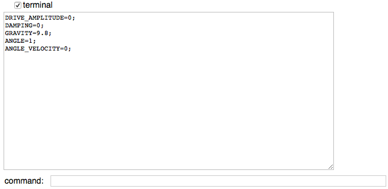

CSS: ./Overview_2.css
Title: Customizing myPhysicsLab
HTML Header: <meta name="viewport" content="width=device-width, initial-scale=1">

[myPhysicsLab Documentation](index.html)

# Customizing myPhysicsLab Simulations

This page describes how to customize
[myPhysicsLab simulations](https://www.myphysicslab.com) using only a browser and
text editor.

Contents of this page:

+ [The Share Button][]
+ [Customizing with EasyScript][]
+ [Customizing with JavaScript][]
+ [Customizing the Start-Up HTML Page][]
+ [Terminal for Script Execution][]
    + [Terminal Utilities][]
    + [Command Short Names][]
+ [Miscellaneous Script Locations][]
    + [Memorizable][]
    + [FunctionVariable][]
    + [ClockTask][]
    + [GenericObserver][]

Additional information:

+ [Setting Initial Conditions](Set_Initial_Conditions.html)
+ [Getting Numbers with VarsHistory](GetNumbers1.html) to get simulation data over time
+ [Getting Numbers with Javascript](GetNumbers2.html) to get simulation data over time
+ [Getting Collision Data](GetNumbers3.html)
+ [Stop Simulation at a Certain Time](StopScript.html) and other similar tasks.
+ [myPhysicsLab Architecture](Architecture.html) has an introduction to classes
    and interfaces.
+ [myPhysicsLab Documentation](index.html) has detailed documentation of classes and
    interfaces.
+ [Building myPhysicsLab Software](Building.html) has information about building,
    testing, internationalization, and general programming issues.

# The Share Button

Clicking the "share" button is the **easiest way to customize** a simulation.

1. Modify the simulation by changing parameters such as gravity, damping,
    and by dragging objects with your mouse.

2. Click the "share" button. Copy the URL from the dialog.

3. Paste the URL in an email. Or save it in a text file for later use.

When the recipient clicks the URL, the EasyScript that is embedded in the URL will
replicate the conditions that you set up.

If you click the "share" button while the simulation is **paused**, the resulting
URL will contain `RUNNING=false`. You should change that to `RUNNING=true` if you
want the simulation to start immediately when the recipient clicks on the link.

To get more exact control over the initial conditions (position and velocity) see
the section below about *Customizing with EasyScript*.

# Customizing with EasyScript

EasyScript allows setting any Parameter or Variable of an application.

EasyScript is a simple scripting language with just one command:
assignment. Here is an example of an EasyScript that you can use in
[PendulumApp](https://www.myphysicslab.com/pendulum/pendulum-en.html)

    ANGLE=-2.5; ANGLE_VELOCITY=-4; GRAVITY=5; DAMPING=0.1;

Click the "Terminal" checkbox which opens a command line interface where you can enter
the above EasyScript. See the section below
[Terminal for Script Execution][] for more about Terminal.

To find other possible parameter names, type `values` into Terminal which shows all the
names that can be set and their current values:

    > values
    APP.SHOW_ENERGY=false;
    APP.SHOW_CLOCK=false;
    APP.PAN_ZOOM=false;
    SIM.LENGTH=1;
    SIM.DAMPING=0.1;
    SIM.MASS=1;
    SIM.DRIVE_AMPLITUDE=0;
    SIM.DRIVE_FREQUENCY=0.6666666666666666;
    SIM.GRAVITY=5;
    DIFF_EQ_SUBJECT.DIFF_EQ_SOLVER=RUNGE_KUTTA;
    SIM_RUNNER.TIME_STEP=0.025;
    SIM_RUNNER.DISPLAY_PERIOD=0.025;
    SIM_RUNNER.RUNNING=true;
    CLOCK.TIME_RATE=1;
    STATUS_VIEW.WIDTH=20;
    STATUS_VIEW.HEIGHT=20;
    STATUS_VIEW.CENTER_X=0;
    ...
    SIM_VIEW.WIDTH=4;
    SIM_VIEW.HEIGHT=3.7;
    SIM_VIEW.CENTER_X=0;
    SIM_VIEW.CENTER_Y=-0.3500000000000001;
    SIM_VIEW.SCALE_X_Y_TOGETHER=true;
    SIM_VIEW.VERTICAL_ALIGN=MIDDLE;
    SIM_VIEW.HORIZONTAL_ALIGN=MIDDLE;
    SIM_VIEW.ASPECT_RATIO=1;
    SIM_VARS.ANGLE=0.0000020353495509370503;
    SIM_VARS.ANGLE_VELOCITY=-4.825144476856234e-7;
    SIM_VARS.TIME=307.1499999999945;
    SIM_VARS.ANGLE_ACCELERATION=-0.000010128496309909662;
    SIM_VARS.KINETIC_ENERGY=1.164100961126811e-13;
    SIM_VARS.POTENTIAL_ENERGY=-3.999999999989643;
    SIM_VARS.TOTAL_ENERGY=-3.9999999999895266;

Consider the first value shown:

    APP.SHOW_ENERGY=false;

The first part of the identifier, `APP`, is the **name of the Subject**. This is the
name of the application that sets up the simulation, user interface and display.

The second part of the identifier, `SHOW_ENERGY`, is the **name of the Parameter**.
That Parameter controls whether the energy bar graph is shown. The "show energy"
checkbox also modifies this Parameter.

The **Subject name is optional when the Parameter name is unique** among all the
Subjects. This is why we can say simply `ANGLE=-2.5` instead of `SIM_VARS.ANGLE=-2.5`.
Some Parameter names are not unique, such as `WIDTH`, so the Subject name must be
specified in that case.

Here are some ways to use EasyScript:

+ Click the **Share Button** which displays a
    [URL query script](./classes/lab_util_Terminal.Terminal.html#md:url-query-script)
    that replicates the current simulation state. You can then copy the
    URL to the clipboard and paste it in an email.

+ In Terminal you can enter EasyScript at the command line, see the example above.

+ In Terminal the `script` command prints the simplest EasyScript that replicates the
    current simulation state. This script can be copied and used later.

        > script
        DAMPING=0.1;GRAVITY=5;RUNNING=false;ANGLE=-2.5;ANGLE_VELOCITY=-4;

    When the simulation is paused you will see `RUNNING=false`. Change the value
    to `RUNNING=true` to have the simulation start playing when the EasyScript
    is executed.

+ In Terminal the `url` command prints the same **URL query script** that you get from
    using the "share" button. It is a combination of the URL for the current page, a
    question mark, and the result of the `script` command. The *query* part of the URL
    is the part following the question mark.

    The URL can be saved in a text file or sent to someone else to view the customized
    simulation. Here is an example:

        > url
        https://www.myphysicslab.com/pendulum/pendulum-en.html?DAMPING=0.1;GRAVITY=5;
        RUNNING=true;ANGLE=-2.5;ANGLE_VELOCITY=-4;

EasyScript can be mixed with JavaScript, see [Customizing with JavaScript][] below.

See [Customizing the Start-Up HTML Page][] below for more ways to use EasyScript.

See [EasyScriptParser documentation](./classes/lab_util_EasyScriptParser.EasyScriptParser.html) for
more details.

# Customizing with JavaScript

Using JavaScript to customize a simulation allows access to the full set of classes and
methods of myPhysicsLab, as well as anything that can be done with JavaScript.

JavaScript can be put in `

Here is an example of JavaScript that can be added to `SingleSpringApp.html`
to customize [SingleSpringApp](./classes/sims_springs_SingleSpringApp.SingleSpringApp.html). The
commands are executed in Terminal via `app.eval`.

    

Here is an example which uses regular JavaScript directly (not executed via Terminal):

    

The reason the script is enclosed in a self-executing function is so that the local
variables stay local and do not become global variables.

The compiled JavaScript application **determines what classes are available** for
scripting. Usually the compiled JavaScript file contains code for only a single
simulation and application (the application instantiates the various pieces such as the
simulation, the display and user interface). But it is possible to include several
simulation and application classes in a compiled JavaScript file.

An example of **multiple simulations in one JavaScript file** is
[TerminalSpringApp](./classes/sims_springs_TerminalSpringApp.TerminalSpringApp.html) which includes
most of the spring simulations (those in the namespace `myphysicslab.sims.springs`).
Each HTML file can have a script which instantiates and runs any of those
simulations. The following HTML files both use `TerminalSpringApp.js` but show
different simulations:

+ `TerminalSpringApp.html` runs `SingleSpringSim`, you can try the
    [online version](https://www.myphysicslab.com/develop/build/sims/springs/TerminalSpringApp-en.html).

+ `TerminalSpring2DApp.html` runs `Spring2DSim`, you can try the
    [online version](https://www.myphysicslab.com/develop/build/sims/springs/TerminalSpring2DApp-en.html).

# Terminal for Script Execution

The Terminal class provides a **command line interface** that allows executing script
commands, both EasyScript and JavaScript, and displays the results of those commands.
See the above section [Customizing with JavaScript][] for more about using JavaScript.
See the [Terminal documentation](./classes/lab_util_Terminal.Terminal.html) for more details.

In most myPhysicsLab applications the Terminal input and output text areas can be made
visible by **clicking the "Terminal" checkbox**, as seen in this screenshot:

The Terminal class provides an **input text area** for the user to enter JavaScript or
EasyScript scripts, and an **output text area** showing the results of the scripts
that are entered. In the output text area, commands are preceded by '> '.

## Terminal Utilities

When you type a command into Terminal, it is executed and the result is displayed in
the Terminal output text area. If the command ends with a semicolon then the printing
of the result is suppressed. Multiple commands separated by semicolons or new lines
can be given in one line.

Some useful utilities available in Terminal:

+ `help` shows useful commands, and the compilation date.

+ `vars` shows the names of available variables. For example there are usually
    variables named `app` for the application and `sim` for the simulation.

+ You can see the contents of most objects by typing the name which results in
    the object's `toString()` method being called.

+ `prettyPrint(app)` inserts carriage returns and indentation to make the `toString()`
    result more readable. Synonym for
    [Util.prettyPrint](./classes/lab_util_Util.Util.html#prettyPrint).

+ `prettyPrint(app, 5)` does prettyPrinting with indentation level of 5 instead of
    the default indentation level of 3.

+ `methodsOf(app)` shows the available methods that can be called on the object.
    Synonym for
    [Util.methodsOf](./classes/lab_util_Util.Util.html#methodsOf).

+ `propertiesOf(app)` shows the names of properties of an object. Synonym for
    [Util.propertiesOf](./classes/lab_util_Util.Util.html#propertiesOf).
    Useful especially to see the what is defined on `app` which is the usual name for
    the application that creates the simulation.

+ `propertiesOf(app, true)` shows the properties and values of object `app`

## Command Short Names

To make using JavaScript in Terminal more user-friendly – with less typing, less
remembering long path names – we define a set of "short names" for important objects.
For example, in many applications we can type just

+ `sim` instead of `app.sim`
+ `simCanvas` instead of `app.layout.simCanvas`
+ `PointMass` instead of `lab$model$PointMass`

These short-names are implemented by defining a set of regular expression replacements
which are applied to the Terminal input string.

The `vars` command in Terminal shows the set of available variables, most of which are
short-names.

The regular expressions for short-names are defined in two places:

+ [Terminal.stdRegex](./classes/lab_util_Terminal.Terminal.html#stdRegex) defines a
    standard set of short-name regular expressions; mostly class names, but also useful
    functions like `prettyPrint`, `methodsOf`, `println` and `propertiesOf`.

+ Each application usually has a method called `defineNames` which defines short-name
    regular expressions unique to that application. See for example
    [DoublePendulumApp.defineNames]
    (./classes/sims_pendulum_DoublePendulumApp.DoublePendulumApp.html#defineNames).

For more information, see
[Short Names](./classes/lab_util_Terminal.Terminal.html#shortnames) in the
Terminal class documentation.  See the section about
[Global Variables](Building.html#globalvariables) to learn
about what global variables are available, such as `app` and `myphysicslab`.

# Miscellaneous Script Locations

Scripts can be set up to execute at a future time.

+ To execute a script repeatedly, use Memorizable.
+ To create a variable whose value is defined by a script, use FunctionVariable.
+ To execute a script at a certain time, use ClockTask.
+ To execute a script when certain events occur, use GenericObserver.

## Memorizable

[GenericMemo](./classes/lab_util_Memo.GenericMemo.html) is a
[Memorizable](./interfaces/lab_util_Memo.Memorizable.html) which can be installed so that it
is executed after each simulation time step.

The documentation of GenericMemo shows an example that prints the value of a simulation
variable into the Terminal output area. Here `simRun` is an instance of
[SimRunner](./classes/lab_app_SimRunner.SimRunner.html).

    var angle = sim.getVarsList().getVariable('ANGLE');
    var memo = new GenericMemo(()=> println('angle: '+angle.getValue()));
    simRun.addMemo(memo);

That code can be entered as Terminal commands in
[PendulumApp](./classes/sims_pendulum_PendulumApp.PendulumApp.html).

## FunctionVariable

[FunctionVariable](./classes/lab_model_FunctionVariable.FunctionVariable.html) is a
Variable whose value is defined by a JavaScript function.

An example of using FunctionVariable is in
[SingleSpringApp](./classes/sims_springs_SingleSpringApp.SingleSpringApp.html).
This adds a variable whose value is `sin(time)`:

    var va = sim.getVarsList();
    var fnv = new FunctionVariable(va, 'sin_time', 'sin(time)', () => Math.sin(sim.getTime()))
    va.addVariable(fnv);

The variable can then be displayed in a graph.

## ClockTask

[ClockTask](./classes/lab_util_Clock.ClockTask.html) holds a callback function to be
executed at a specified time; it is used with a
[Clock](./classes/lab_util_Clock.Clock.html). The documentation of ClockTask shows an
example that pauses the Clock after 5 seconds:

    var task = new ClockTask(5, () => clock.pause());
    clock.addTask(task);

## GenericObserver

A [GenericObserver](./classes/lab_util_Observe.GenericObserver.html) observes a Subject;
when the Subject broadcasts a SubjectEvent then this executes a specified function. See
the section about [Subject-Observer](Architecture.html#subjectobserverparameter) in the
Architecture overview.

Here is an example of a GenericObserver that prints
any event broadcast by a [Clock](./classes/lab_util_Clock.Clock.html).
This code can be entered in Terminal

    var obs = new GenericObserver(clock, evt =>  println('event='+evt));

The next example prints only when a particular event occurs:

    var obs = new GenericObserver(clock, evt => {
        if (evt.nameEquals(Clock.CLOCK_PAUSE)) println('event='+evt)});

&nbsp;

&nbsp;
