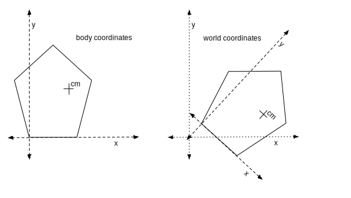
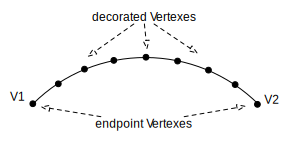

CSS: ./Overview_2.css
Title: 2D Physics Engine Overview

[Baraff_94]: ./Baraff_Fast_Contact_Force_94.pdf

<!-- Copyright 2016 Erik Neumann. All Rights Reserved.
* Use of this source code is governed by the Apache License, Version 2.0.
* See the LICENSE file and http://www.apache.org/licenses/LICENSE-2.0.
-->

# 2D Physics Engine Overview

[myPhysicsLab](http://www.myphysicslab.com) provides classes to build real-time
interactive animated physics simulations. This page gives an introduction to the
2D Rigid Body Physics Engine which is contained in the namespace
`myphysicslab.lab.engine2D`.

Contents of this page:

+ [The Math Behind the Physics Engine][]
+ [RigidBody][]
    + [Body Coordinates][]
    + [Polygon][]
    + [Scrim][]
+ [Physics Engine][]
    + [RigidBodySim, ImpulseSim and ContactSim][]
    + [Penetration Policy and Preventing Stuckness][]
    + [Solving for Contact Forces][]
    + [Solving for Collision Impulse][]
+ [Advance Strategy][]
    + [Seek to Half-Gap Distance][]
    + [Estimate Collision Time][]
    + [Updating Collisions][]
    + [Imminent Collisions][]
    + [Observing The Collision Handling Process][]
+ [Collisions and Contacts][]
    + [Collisions][]
    + [Contacts][]
    + [Collision Detection][]
    + [Vertex/Edge Collision Detection][]
    + [Detecting High Speed Collisions][]
    + [Edge/Edge Collision Detection][]
    + [Decorated Vertexes][]
    + [Multiple Simultaneous Collisions][]
+ [Connectors][]
    + [Joints][]
    + [Ropes][]
+ [Performance Issues][]
    + [How to Stop Jitter][]
    + [ComputeForces Performance][]
+ [Future Improvements][]
    + [Matrix Solution Algorithm][]
    + [Friction][]

# The Math Behind the Physics Engine

This overview describes how the physics engine software is organized and some of the
issues involved. See the following references for the math and physics behind the
physics engine. The rest of this overview assumes some familiarity with this
information.

+ [2d Rigid Body Physics Engine](http://www.myphysicslab.com/explain/physics-engine_en.html)
    introduction to the Physics Engine
+ [differential equations](http://www.myphysicslab.com/engine2D/rigid-body/rigid-body_en.html#differential_equations)
    for movement of RigidBody objects with various forces acting
+ [physics of collisions for rigid bodies](http://www.myphysicslab.com/engine2D/collision/collision_en.html#collision_physics).
+ [contact force calculation](http://www.myphysicslab.com/engine2D/contact/contact_en.html)
+ [ContactSim Math](ContactSim_Math.html) has details about the math involved in
    the physics engine.
+ [ContactSim documentation](myphysicslab.lab.engine2D.ContactSim.html) has
    a summary of how ContactSim works.

Relevant papers:

+ **Baraff '94** David Baraff,
    [Fast Contact Force Computation for Nonpenetrating Rigid Bodies.][Baraff_94]
    *Computer Graphics Proceedings, Annual Conference Series, 1994* pages 23-34.

+ David Baraff,
    [An Introduction to Physically Based Modeling: Rigid Body Simulation     II—Nonpenetration Constraints.](Baraff_Siggraph_97_Course_Notes.pdf)
    *Siggraph '97 Course Notes*.

+ Erik Neumann, [Curved Edge Physics](CEP_Curved_Edge_Physics.pdf)
    about modifications of the Baraff algorithm for curved edges.

Information about myPhysicsLab software in general:

+ See [myPhysicsLab Architecture](Architecture.html) for an introduction to classes
    and interfaces.
+ See [myPhysicsLab Documentation](index.html) for detailed documentation of classes and
    interfaces.
+ The [myPhysicsLab website](http://www.myphysicslab.com) shows the simulations
    running and contains explanations of the math behind them.
+ See [Building myPhysicsLab Software](Building.html) for information about building,
    testing, internationalization, and general programming issues.

# RigidBody

A [RigidBody](myphysicslab.lab.engine2D.RigidBody.html) in the 2D world of the engine2D
physics engine has 3 degrees of freedom: it can translate in the X and Y directions, or
rotate about its center of gravity. The position of a RigidBody is specified by the X
and Y location of its center of gravity, and the angle of rotation about the center
of gravity.

A RigidBody knows its current velocity and position. See the RigidBody methods
`getPosition()`, `getAngle()`, `getVelocity()`. A RigidBody can calculate its
translational and rotational energy and momentum. See `translationalEnergy()`,
`rotationalEnergy()`, `momentum()`.

A RigidBody has a specified mass, and also an indication of how its mass is
distributed by specifying the *moment* about center of mass, see `momentAboutCM()`.
The higher the moment, the more force it takes to rotate the body around its center of
mass.

## Body Coordinates

Each RigidBody has its own local coordinate system called *body coordinates*,
distinct from *world coordinates* (also called *simulation coordinates*). There are
methods for converting between body and world coordinates, see
[MassObject](myphysicslab.lab.model.MassObject.html).

In the diagram below we show a Polygon drawn in its body coordinates on the left. On the
right is the Polygon moved so that its center of mass (cm) is at a certain world
coordinates position, and the Polygon is rotated clockwise approximately 45 degrees. The
body coordinate axes for the Polygon are superimposed as well – this shows that you can
convert between the two coordinate systems.

In the diagram, `cm` is the center of mass; it can be anywhere within the body, see
[RigidBody.setCenterOfMass()](myphysicslab.lab.engine2D.RigidBody.html#setCenterOfMass).

When the Polygon is positioned in world coordinates, we specify the location of the
center of mass and the rotation around the center of mass. The rotation is with respect
to body coordinates, so a rotation of zero would look the same as the picture on the
left, but translated to wherever the center of mass should be. A rotation of `pi/2`
would rotate the body 90 degrees counter clockwise.

## Polygon

[Polygon](myphysicslab.lab.engine2D.Polygon.html) is the concrete class that implements
the RigidBody interface. A Polygon has a particular fixed geometry specified by a list
of [Vertexes](myphysicslab.lab.engine2D.Vertex.html) and
[Edges](myphysicslab.lab.engine2D.Edge.html) which are defined using body coordinates.

The two concrete implementations of Edge are
[StraightEdge](myphysicslab.lab.engine2D.StraightEdge.html) and
[CircularEdge](myphysicslab.lab.engine2D.CircularEdge.html). Each Edge has knowledge
about which side of the Edge is inside or outside of the Polygon. Therefore a
CircularEdge can be concave or convex.

A Polygon can have a more complex shape, for example a
[doughnut shape](myphysicslab.lab.engine2D.Shapes.html#Shapes.makeFrame). Edges cannot
cross but there can be several paths. For the doughnut shape there are two paths – the
outside and inside path of the doughnut.

Each Polygon has 6 variables in the [VarsList](myphysicslab.lab.model.VarsList.html)
to specify the position and velocity of its center of mass (in world coordinates)

1. **X-position** of center of mass in world coordinates
2. **X-velocity**
3. **Y-position** of center of mass in world coordinates
4. **Y-velocity**
5. **angle of rotation** about center of mass, relative to body coordinates position;
    in radians; positive is counter-clockwise
6. **angular velocity**

These variables evolve over time based on what forces are applied to the bodies.

## Scrim

[Scrim](myphysicslab.lab.engine2D.Scrim.html) is a concrete class that implements the
RigidBody interface. It is used as the **fixed background** which objects can be
attached to with Joints or Ropes. It has infinite mass, infinite extent, never collides
with anything, has no edges or Vertexes, and is an immutable singleton object. Scrim
has no variables stored in the VarsList.

# Physics Engine

A physics engine calculates the forces needed in a physics simulation so that the
objects behave according to laws of physics. There are many types of physics engines
depending on what kind of objects are being simulated and what laws of physics they
should obey. For example, fluid flow requires a very different physics engine than a
rigid body simulation. Among rigid body physics engines some implement surface friction,
some work on 3D objects, some handle deformable bodies, etc.

## RigidBodySim, ImpulseSim and ContactSim

The physics engine described here works on 2D non-penetrating RigidBody objects,
without surface friction, and the bodies are not deformable. The physics engine is
implemented by [RigidBodySim](myphysicslab.lab.engine2D.RigidBodySim.html) and its
sub-classes [ImpulseSim](myphysicslab.lab.engine2D.ImpulseSim.html) and
[ContactSim](myphysicslab.lab.engine2D.ContactSim.html), along with several other
`engine2D` classes such as ComputeForces, CollisionAdvance, CircularEdge, StraightEdge
and others.

The simulation state is stored in an array of variables in a VarsList object. There are
six variables for each Polygon as described earlier.

Like any other [ODESim](myphysicslab.lab.model.ODESim.html), RigidBodySim defines
differential equations in its `evaluate()` method. Those differential equations
implement the forces on the RigidBody objects and are integrated over time by a
DiffEqSolver resulting in the movement of the RigidBody objects. Forces appear as
changes to the accelerations returned by the `evaluate()` method.

ImpulseSim handles collisions between RigidBody objects; these
collisions happen instantaneously, not thru the application of forces over time. When a
collision is detected, a process occurs to "rewind" or "undo" the current simulation
time step to the state before the collision, and then a smaller time step is taken to
try to get close to the moment just before the collision occurs. Then ImpulseSim
directly modifies the velocities of the RigidBody objects involved in the collision to
what they should be after the collision.

ContactSim calculates the contact forces needed to prevent RigidBody
objects from interpenetrating. Only bodies that are very close together and not
colliding can have contact forces. The contact forces show up in the differential
equations like other forces do: as changes to accelerations of the RigidBody objects;
these forces are calculated in the `ContactSim.evaluate()` method. Just as with
other forces, the accelerations are integrated over time by a DiffEqSolver, resulting
in the motion of the RigidBodys.

There are three ways the physics engine can be used:

1. **no collisions or contacts**
    If you don't want collisions or contacts, you should use RigidBodySim. This has the
    differential equations governing the motion of the rigid bodies, but objects will
    simply pass thru each other instead of colliding. You can still have whatever
    forces you want operating on the rigid bodies, such as gravity, damping, spring
    force, etc.

2. **collisions only**
    If you only want collisions but not contacts, use ImpulseSim directly without
    ContactSim. ImpulseSim will find collisions between RigidBody objects and handle
    the collisions by applying the appropriate impulse. The process of finding and
    handling collisions happens inbetween the time steps of the differential equation
    solver.

    Note that without contact forces, the simulation can easily get stuck in cases
    where objects would settle against each other, such as a ball bouncing on the
    ground and losing some energy on each bounce.

3. **both contacts and collisions**
    This is the usual way to use the physics engine, which you do by instantiating
    ContactSim. During the differential equation calculation, in the `evaluate()`
    method, contact points between objects are found and the necessary contact force is
    calculated for each contact point.

## Penetration Policy and Preventing Stuckness

Some physics engines allow objects to interpenetrate when they collide or are in close
contact with each other. Typically such a physics engine will have the objects deforming
to some extent and/or pushing against each other over time until they no longer overlap.

This physics engine is designed to *prohibit* objects penetrating each other, it works
only on non-penetrating rigid bodies. Detecting a penetration (overlap) between objects
means that a *collision* has occurred. We then *back up in time* to just before the
collision – so the objects are not overlapping – and apply an *impulse* to reverse the
collision.

The *back up in time* process is done with a binary search, taking successively smaller
steps until the objects are very close to each other but not overlapping. See
[`CollisionAdvance.advance()`](myphysicslab.lab.model.CollisionAdvance.html#advance)
where the "back up in time" process occurs.

If a collision cannot be resolved by the above process, then the simulation becomes
**stuck**. "Resolving the collision" means that the bodies move apart after the impulse
is applied, and we end the time step with no penetration. Collisions can only be
detected as a transition from a non-penetrating state, so a persistent penetration
means we can no longer detect collisions going forward.

For objects that are in *contact* – pressing against each other – we maintain a **small
gap** between the objects, to avoid penetration. If the gap between objects is allowed
to get close to zero, then inevitably a series of tiny penetrations will occur as the
objects move about; these irrelevant tiny collisions greatly slow down the simulation
because the "back up in time" mechanism happens; such a tiny collision is typically at
very low speed and often cannot be corrected with an impulse and then the simulation
will become stuck: the simulation is unable to resolve that penetration, and therefore
unable to continue. This is discussed further in the section
[Seek to Half-Gap Distance][].

There are additional "non-physical" policies that are used to preserve the gap between
objects that are in contact. See
[`ContactSim.getExtraAccel`](myphysicslab.lab.engine2D.ContactSim.html#getExtraAccel)
for one such policy.

Some objects *are* allowed to overlap each other, as for example two objects that are
connected by a Joint to form a pendulum. This is done by explicitly stating that the
objects do not collide with each other, see
[`RigidBody.addNonCollide`](myphysicslab.lab.engine2D.RigidBody.html#addNonCollide)
and
[`Polygon.setNonCollideEdge`](myphysicslab.lab.engine2D.Polygon.html#setNonCollideEdge).

## Solving for Contact Forces

See the section above about the math behind the physics engine for details, but here is
a simplified overview of the process of solving for contact forces:

1. The **set of contacts is found**. the points where objects are close together and
    not moving relative to each other. This is represented as an array of
    RigidBodyCollisions.

2. The **external forces** (gravity, springs, etc.) **are applied** to all RigidBody
    objects. This is done by `RigidBodySim.evaluate()` which calculates the
    accelerations (absent contact forces) on all the variables representing the
    RigidBody positions and velocities.

3. the **`A` matrix is constructed** where each row corresponds to a contact point,
    and the number at the `A[i,j]` entry tells how much the acceleration at contact `i`
    will change from a unit amount of force being applied at contact `j`.

4. the **`b` vector is determined** which corresponds to acceleration from the external
    forces at each contact point. For example, a spring might be accelerating a body
    into another body resulting in their contact point having negative (penetrative)
    acceleration before contact forces are applied.

5. We **find the contact forces** `f` by solving the matrix equation `a = A f + b`,
    subject to the constraints that `f >= 0`, `a >= 0`, and `f.a = 0`. The matrix
    equation says that the acceleration `a` at each contact point is equal to the
    acceleration from external forces (the `b` vector) plus the acceleration from
    contact forces (the `A` matrix times `f` contact forces). The constraints say that
    contact forces can only push things apart, that objects cannot interpenetrate, and
    that if objects are separating then there is no contact force.

The `A` matrix and `b` vector are set up in ContactSim. The solving of the matrix
equation to find contact forces is done in
[ComputeForces](myphysicslab.lab.engine2D.ComputeForces.html).

## Solving for Collision Impulse

When solving for collision impulse, the problem is similar to solving for contact
forces.

Consider a group of bodies that are in contact with each other. If you push on any one
of the bodies, potentially every other body can be affected; this is represented in the
`A` matrix and the contact forces are found by solving a matrix equation.

For collision impulses, we have the same relationships between the bodies. So we can
use the *exact same solving algorithm* for both calculating contact forces and
calculating collision impulses. And even the `A` matrix used is the same in both cases.

We include contacts and Connectors like Joint in the set of collisions when solving for
collision impulse, because a collision can "ricochet" (bounce back-and-forth) among
several objects. Examples include
[Newton's Cradle](myphysicslab.sims.engine2D.NewtonsCradleApp.html),
or a block crashing into a group of blocks that are in resting contact.

# Advance Strategy

The [AdvanceStrategy](myphysicslab.lab.model.AdvanceStrategy.html) controls the process
of advancing the simulation in time. This is where the "binary search" happens to "back
up in time" to the moment before a collision, and then requests that the collisions
should be handled. The AdvanceStrategy typically used in Engine2D simulations is
[CollisionAdvance](myphysicslab.lab.model.CollisionAdvance.html). If you like to read
code in the order that things happen, the place to start is
[`CollisionAdvance.advance`](myphysicslab.lab.model.CollisionAdvance.html#advance).

CollisionAdvance has some additional features that improve performance including
dealing with imminent collisions, and estimating collision time.

## Seek to Half-Gap Distance

As explained above in the section
[Penetration Policy and Preventing Stuckness][], we need to ensure that objects
have a small but "healthy" gap between them to prevent the simulation from becoming
"stuck" and unable to proceed. If the gap becomes too small, then a series of low speed
or unresolveable collisions can occur.

Objects are considered to be touching when the distance between them is smaller than
the "gap" distance which is returned by
[`ContactSim.getDistanceTol`](myphysicslab.lab.engine2D.ContactSim.html#getDistanceTol).
The default gap distance is 0.01. When objects are closer than around 0.0001 then
unresolveable collisions can occur. So we try to maintain the distance between objects
at the **half-gap distance** of 0.005 or greater.

The "back up in time" process that searches to the moment before collision is designed
to seek to the time when the objects are at the healthy "half-gap" distance.

A typical problem seen when the simulation becomes stuck is this: the velocity is very
small, and so we cannot apply a large enough impulse to cause the objects to move apart.
If two objects are separated by a half-gap of 0.005, then the smallest collision
velocity we expect would travel that half-gap distance over one time step. With a
typical time step of 0.025 this gives a velocity of 0.005/0.025 = 0.2 which is a small
velocity, but in practice is large enough to reverse a collision.

Another mechanism to maintain the half-gap distance and prevent low-speed collisions is
the *extra acceleration* applied at contact points, see `ContactSim.setExtraAccel()`
and the section below [How to Stop Jitter][].

## Estimate Collision Time

This is an improvement to the "back up in time" [binary search
algorithm](http://en.wikipedia.org/wiki/Binary_search_algorithm). In CollisionAdvance
we back up to just before the earliest *estimated collision time* among the current set
of collisions. This can avoid binary search steps, resulting in better performance.

The collision time is estimated from the distance and velocity of the collision in the
pre-backup and post-backup states. See
[`RigidBodyCollision.getEstimatedTime`](myphysicslab.lab.engine2D.RigidBodyCollision.html#getEstimatedTime).
There are cases where an estimated time is not available, in which case
CollisionAdvance reverts to using binary search algorithm.

After doing the "back up in time", we advance the simulation in a single step to get to
just before the estimated collision time. Then whatever collisions satisfy the "close
enough" criteria specified in
[`RigidBodyCollision.closeEnough`](myphysicslab.lab.engine2D.RigidBodyCollision.html#closeEnough)
are passed to
[`ImpulseSim.handleCollisions`](myphysicslab.lab.engine2D.ImpulseSim.html#handleCollisions)
which figures out and applies the appropriate impulses to reverse the collisions.

## Updating Collisions

To improve the accuracy of collision handling, we recalculate much of the information
stored in a RigidBodyCollision when we are doing the "back up in time" process and
seeking to get close to the moment of collision. This recalculation is done in
[`RigidBodyCollision.updateCollision`](myphysicslab.lab.engine2D.RigidBodyCollision.html#updateCollision).

Because a collision is usually detected when the bodies are penetrating, the initial
information in the RigidBodyCollision will show a negative distance (indicating
penetration). Once we back up to the moment before collision, the RigidBodyCollision
will show a positive distance.

Before calculating the collision impulse, we recalculate the location of the collision
impact point which is the an important piece of information that affects where the
collision impulse is applied on each of the bodies. Other information is recalculated as
well, such as the vector from the center of mass to the impact point.

## Imminent Collisions

Imminent collisions are generated by contact detection code;
their distance is positive; their velocity is
negative and large. As long as the collision satisfies the
[Collision.closeEnough](myphysicslab.lab.model.Collision.html#closeEnough)
criteria, we can handle
an imminent collision when it is detected. Because they have too much velocity,
ContactSim ignores imminent collisions for determining contact forces.

Imminent collisions are somewhat rare, but handling them can improve performance a bit
by avoiding the need to backup again to handle them. In a situation where a group of
objects are in contact when the collision occurs (for example in
[Newton's Cradle](myphysicslab.sims.engine2D.NewtonsCradleApp.html) and are bouncing
rapidly back-and-forth against each other, this can save a lot of time because it all
happens inside of
[ImpulseSim.handleCollisions](myphysicslab.lab.engine2D.ImpulseSim.html#handleCollisions).
This contrasts with handling each collision separately, trying to step forward, and
coming back to the same time to handle another ricochet collision; which can happen over
and over.

## Observing The Collision Handling Process

The best way to understand the rather complex process of collision handling is to
observe it with the browser console. In the constructor for the application, find where the `CollisionAdvance` instance is created:

    this.advance = new CollisionAdvance(this.sim);

then turn on debug messages:

    this.advance.setDebugLevel(CollisionAdvance.DebugLevel.OPTIMAL);

Alternatively, you can specify a particular set of debug waypoints to observe like this:

    this.advance.setWayPoints([WayPoint.COLLISIONS_TO_HANDLE,
      WayPoint.HANDLE_REMOVE_DISTANT,
      WayPoint.HANDLE_COLLISION_SUCCESS,
      WayPoint.PRE_COLLISION,
      WayPoint.POST_COLLISION]);

Start the application by loading its start-up HTML page in your browser and open the
browser's console window to see the debug messages. It is helpful to slow down the
simulation by setting the "time rate" to a slow rate like 0.1. Turn on the "show clock"
option to see the current time in the simulation view. Pausing and single-stepping the
simulation helps to be able read the messages, because then the simulation view
corresponds to the debug messages you are reading. Turn on the "show forces" option to
see contact forces and collision impulses as they are applied.

You can use the "remember" function of Terminal to save these various settings for the
next time you run the simulation.
See [Script Storage](myphysicslab.lab.util.Terminal.html#scriptstorage).

It is helpful to show the names of the objects in the simulation view by setting this
class property before making DisplayShape objects:

    DisplayShape.nameFont = '10pt sans-serif';

It is possible to see a visual representation of the collision handling mechanism
happen. See the documentation in the source code of the private property `debugPaint_`
of CollisionAdvance.

# Collisions and Contacts

Collisions and contacts are represented an instances of a sub-class of
[RigidBodyCollision](myphysicslab.lab.engine2D.RigidBodyCollision.html).
Collisions and contacts and are found within
[`ImpulseSim.findCollisions`](myphysicslab.lab.engine2D.ImpulseSim.html#findCollisions)
by calling
[`Polygon.checkCollision`](myphysicslab.lab.engine2D.Polygon.html#checkCollision)
for each pair of bodies that can possibly collide.

## Collisions

A collision between two RigidBodys is a momentary event that results in an
[impulse](https://en.wikipedia.org/wiki/Impulse_(physics))
which reverses the collision. Collisions are resolved *between* time steps of the
differential equation solver during the method
[ImpulseSim.handleCollisions](myphysicslab.lab.engine2D.ImpulseSim.html#handleCollisions). See the myPhysicsLab website for math details about
[how collision impulse is calculated](http://www.myphysicslab.com/collision.html).

For any Polygon you can specify what other objects it *does not* collide with, see
[`Polygon.addNonCollide`](myphysicslab.lab.engine2D.Polygon.html#addNonCollide)
and
[`Polygon.setNonCollideEdge`](myphysicslab.lab.engine2D.Polygon.html#setNonCollideEdge).
Those objects will then be able to overlap. This is useful when connecting objects
together with [Joints][].

The *distance* of a collision (or contact) measures how far apart the objects are at
that point (along the direction of the normal vector which is perpendicular to the
edge). A positive distance means the objects are separated and not interpenetrating. A
negative distance indicates penetration.

This distance of the collision is used during the collision *binary search* process to
advance the simulation to be very close to the moment of collision. During the binary
search process, as we get close to the moment of collision both the time step and the
depth of collision become small. When both of those are very small we are confident
that we are close to the moment of collision. The binary search process is handled by
CollisionAdvance.

## Contacts

Contacts are points where two RigidBodys are touching and exerting a contact force on
each other. The bodies must be very close together at the contact point and not
colliding. See the myPhysicsLab website for math details about
[how contact force is calculated](http://www.myphysicslab.com/contact.html).

At each contact point an appropriate contact force is determined which is just enough
to keep the objects from penetrating into each other – but not more than that, so the
objects do not push each other apart. This calculation is done within
[`ContactSim.evaluate`](myphysicslab.lab.engine2D.ContactSim.html#evaluate).

A contact involves two points, one on each of the two bodies involved. Those two points
must be very close together and not colliding. The "not colliding" criteria means that
their relative normal velocity is close to zero (meaning they are staying in contact).
If their relative normal velocity is positive, it means the points are separating so
they are not in contact. If their relative normal velocity is negative, this indicates
that a [collision is imminent][Imminent Collisions].

The bodies are "close together" when the distance at the contact point is less than
[`ContactSim.getDistanceTol`](myphysicslab.lab.engine2D.ContactSim.html#getDistanceTol).
A contact can have a separation distance of no more than this amount.

The maximum relative normal velocity for a contact is given by
[`ContactSim.getVelocityTol`](myphysicslab.lab.engine2D.ContactSim.html#getVelocityTol).
If the absolute value of the relative normal velocity is greater than this amount, then
a contact is not detected, because the objects are either separating or colliding.

## Collision Detection

Collisions and contacts and are found within
[`ImpulseSim.findCollisions`](myphysicslab.lab.engine2D.ImpulseSim.html#findCollisions)
by calling
[`Polygon.checkCollision`](myphysicslab.lab.engine2D.Polygon.html#checkCollision)
for each pair of bodies that can possibly collide.

There are several varieties of collisions and contacts:

+ [CornerEdgeCollision](myphysicslab.lab.engine2D.CornerEdgeCollision.html) between
    a Vertex and an Edge.

+ [EdgeEdgeCollision](myphysicslab.lab.engine2D.EdgeEdgeCollision.html) between two
    Edges.

+ [ConnectorCollision](myphysicslab.lab.engine2D.ConnectorCollision.html) generated
    by a Connector like Joint or Rope

Each of these types of collisions have significant differences in how they are detected,
and there are further differences depending on whether a CircularEdge or
StraightEdge is involved.

## Vertex/Edge Collision Detection

For Vertex/Edge collisions, we look from the perspective of the Edge; we look at the
current (new) position of the Vertex and the previous (old) position of the Vertex at
the last time step. We draw a line between the new and old Vertex, and if this line
intersects the Edge then we decide there was a collision, and that the impact point was
at the intersection.

We also calculate the *signed distance* of penetration of the Vertex into this Edge.
Negative distance indicates penetration; positive distance indicates the Vertex and Edge
are separated by that distance.

Vertex/Edge collision detection is done by
[`UtilityCollision.checkVertexes`](myphysicslab.lab.engine2D.UtilityCollision.html#UtilityCollision.checkVertexes).
See also the method
[`Polygon.getOldCopy`](myphysicslab.lab.engine2D.Polygon.html#getOldCopy)
which gives the state of a Polygon at the last time step; `getOldCopy` is used to
determine the old position of a Vertex.

## Detecting High Speed Collisions

For very fast moving objects, or very thin shapes, just checking the current position of
corners can miss collisions. Consider a small particle colliding at high speed colliding
into a thin rectangle. In a single time step the particle can pass entirely across the
rectangle so that the objects are never seen to be intersecting.

Also, just checking depth of penetration of a Vertex can give the wrong Edge: a Vertex
may have travelled past the original Edge and now be near an Edge on the other side of
the object.

This is why we look at the *path that Vertexes have travelled* over the last time
segment. If you assume straight line motion between the recent past and now, then you
can analyze those line segments to find collisions. The straight line assumption works
well enough for short time segments.

## Edge/Edge Collision Detection

We assume that Vertex/Edge testing finds the high speed collisions. Therefore Edge/Edge
testing is somewhat less rigorous, generally relying on the more on the static positions
of the edges, and assumes that penetration distances are small.

For StraightEdge/CircularEdge collisions we do require that the previous distance was
positive (non-penetrating) and the current distance is negative (penetrating). So there
is some usage of the "previous" position information. However, that test only works in
low velocity situations because of how the geometry of the "distance of penetration" is
calculated between the edges. See
[`CircleStraight.testCollision`](myphysicslab.lab.engine2D.CircleStraight.html#CircleStraight.testCollision).

For CircularEdge/CircularEdge collisions we only look at the current positions. And we
ignore situations where we detect a deep penetration (more than the "chord depth" of the
circular arcs). This is because of how the "distance of penetration" is calculated
based on the geometry. See
[`CircleCircle.testCollision`](myphysicslab.lab.engine2D.CircleCircle.html#CircleCircle.testCollision).

The distance between the edges is calculated such that negative distance indicates
penetration, and positive distance indicates the edges are separated and not
overlapping.

Edge/Edge collision detection starts in the methods
[`CircularEdge.testCollisionEdge`](myphysicslab.lab.engine2D.CircularEdge.html#testCollisionEdge)
and
[`StraightEdge.testCollisionEdge`](myphysicslab.lab.engine2D.StraightEdge.html#testCollisionEdge).

## Decorated Vertexes

Edge/Edge collision detection assumes the collision is low speed. Therefore if Edges
pass thru each other at high speed the collision would be missed. By
*adding Vertexes along the Edges*, that missed collision has a good chance of being
detected by the high speed Vertex/Edge collision detection scheme, which looks at both
the previous and current positions of Vertexes.

Curved edges are "decorated" with numerous "artificial" Vertexes to aid collision
detection. These *decorated Vertexes* are optional as to their density of placement
along the curved Edge. They are also called *mid-point* Vertexes to distinguish them
from end-point Vertexes (evey Edge has two end-point Vertexes).

These decorated Vertex/Edge collisions have *lower priority* than a corresponding
Edge/Edge collision between the same edges, because the Edge/Edge collision is always
more accurate. When the time step is large, it may be the case that only the Vertex/Edge
collisions are detecting that a collision occurred. As the binary search mechanism
brings the objects close together, at some point we will have both the Vertex/Edge
collisions and the Edge/Edge collisions. At this point, the Vertex/Edge collisions are
discarded in favor of the Edge/Edge collisions, because the latter are more accurate.

For contact detection, the decorated Vertexes are always ignored because Edge/Edge
contacts can always be detected when the objects are close together and not moving
rapidly towards each other.

Note that Vertexes at the end-point of an Edge are a different case than the decorated
Vertexes along the Edge. At the end-point, the Edge/Edge calculations may not be the
most accurate (having the smallest distance). Therefore Vertex/Edge collisions involving
end-point Vertexes can wind up being the surviving collision in some cases.

The density of decorated Vertexes can be set by a spacing parameter when making a curved
Edge. More dense closely spaced Vertexes gives better collision detection but with
greater computational cost.

Summary:

+ For end-point Vertexes, we always use Vertex/Edge collision detection and it is
    always accurate.

+ For mid-point "decorated" Vertexes, we use Vertex/Edge collision detection to
    detect collisions between curved edges when time steps are large. For smaller time
    steps, Edge/Edge collision detection is preferred for its accuracy.

## Multiple Simultaneous Collisions

There isn't a guaranteed theoretically correct way to handle multiple simultaneous
collisions. See the web page at
<http://www.myphysicslab.com/beta/Collision-methods.html> for a discussion.
The `engine2D` code makes several collision handling methods available.

The desired method is specified via
[`ImpulseSim.setCollisionHandling`](myphysicslab.lab.engine2D.ImpulseSim.html#setCollisionHandling)
with a
[CollisionHandling](myphysicslab.lab.engine2D.CollisionHandling.html) enum with
the following choices:

+ **simultaneous**
    Finds impulses such that the resulting velocity at each collision point is equal to
    the opposite of the initial velocity reduced by the elasticity.

+ **serial**
    Handles collisions one at a time (in a random order) accruing the results, until a
    state is reached where there is no collision. You can think of objects ricocheting
    against each other until they either fly apart or the vibration energy is absorbed
    by inelastic collisions. The elasticity should be less than 1.0 otherwise the
    vibrations might never die out in some cases.

+ **hybrid**
    Uses the simultaneous method for sets of collisions that are between the same
    objects, otherwise uses the serial method.

The choice of collision method can make a big difference in the results. An example is
a rectangle falling perfectly flat against the ground, which has two simultaneous
collisions, one at each corner:

+ with *simultaneous or hybrid* collision handling: the rectangle bounces up
    without rotating

+ with *serial* collision handling the collisions at each corner are treated one a
    time, and the result is that the rectangle has some spin when it bounces up.

Either result can be argued to be valid, because in the real world
it is pretty much impossible to have such perfectly aligned and smooth objects.

Another example is
[Newton's Cradle](myphysicslab.sims.engine2D.NewtonsCradleApp.html)
where one object collides into several objects that are in stationary contact. In that
case the serial method clearly gives the correct result and the simultaneous method
gives an incorrect result.

# Connectors

A [Connector](myphysicslab.lab.engine2D.Connector.html) connects RigidBody objects to
each other or to another object like a NumericalPath or Scrim. An example is connecting
a Polygon to a Scrim which simulates a pendulum under gravity. A Connector generates
collisions or contacts to enforce the connection.

ContactSim holds the list of Connectors, see
[`ContactSim.addConnector`](myphysicslab.lab.engine2D.ContactSim.html#addConnector).
During
[`ContactSim.findCollisions`](myphysicslab.lab.engine2D.ContactSim.html#findCollisions)
the Connectors are able to generate collisions or contacts.

There is a method to align the bodies attached to Connectors, see
[`Connector.align`](myphysicslab.lab.engine2D.Connector.html#align) and
[`ContactSim.alignConnectors`](myphysicslab.lab.engine2D.ContactSim.html#alignConnectors).

## Joints

A [Joint](myphysicslab.lab.engine2D.Joint.html) is a Connector that links two
RigidBodys to keep specified points on each body aligned together. An example is
connecting a Polygon to a Scrim to model a pendulum under gravity.

A Joint operates by generating
[ConnectorCollisions](myphysicslab.lab.engine2D.ConnectorCollision.html),
a sub-class of RigidBodyCollision. Those collisions specify an impact point and a
normal vector. Because the normal vector can generate force or impulse only in one
direction, two Joints with orthogonal normals are needed to hold two objects together
at a point. Alternatively, a single Joint can be used for a "sliding" type of
connection.

Joint collisions do not cause the collision binary search mechanism to back up in
time, because Joint collisons are happening continuously and are never resolved.
Joint collisions are marked with a special "joint" boolean flag for this reason, see
[`RigidBodyCollision.bilateral`](myphysicslab.lab.engine2D.RigidBodyCollision.html#bilateral).

The contacts generated by a Joint ensure that enough contact force is generated to keep
the two bodies aligned at the Joint point. At a regular contact the bodies can only
push against each other, they cannot pull. In contrast, a Joint cannot separate, so it
can generate both push and pull force (hence the term "bilateral"). This is why Joint
contacts are treated specially during the process of solving for contact forces.

Although contact forces tend to keep Joints aligned between two rigid body objects, the
bodies will tend to drift, especially when rotating rapidly. This can be seen in the
test
[`PileTest.connected_blocks_pile_test`](myphysicslab.test.PileTest.html#PileTest.connected_blocks_pile_test).

Contact forces can reduce the acceleration between objects to zero, but not the
relative velocities. Only collision impact can correct the non-zero relative velocity
between objects. There is an optional policy that can be set to help with this:
[`CollisionAdvance.setJointSmallImpacts`](myphysicslab.lab.model.CollisionAdvance.html#setJointSmallImpacts)
will cause small collision impacts to occur at a Joint are at every time step to stop
the slow drifting apart of the Joint. See also the section below [How to Stop Jitter][].

## Ropes

[Rope](myphysicslab.lab.engine.Rope.html) is similar to Joint in that it connects two
RigidBodys. The difference is that a Rope allows the two connected points to be a large
distance apart. A Rope generates
[ConnectorCollisions](myphysicslab.lab.engine2D.ConnectorCollision.html)
to ensure that the connected points of the objects stay separated by the specified
distance. ConnectorCollision is a sub-class of RigidBodyCollision.

There are two types of Rope:

1. **Rod**
    Ensures the connected points are separated by *exactly* the specified length.
    Similar to Joint, this creates a continuous stream of ConnectorCollisions. Contact
    forces and collision impulses are generated by the physics engine to ensure the
    separation remains at the specified length.

2. **Rope**
    Ensures the connected points are separated by *no more than* the specified length.
    When the distance between the points exceeds the rope length, then a collision is
    generated; this will cause the physics engine to "back up in time" to get close to
    the moment of collision and apply an impulse to reverse the collision. When the
    points are separated by exactly the rope length, then contact forces are applied to
    maintain that separation.

# Performance Issues

## How to Stop Jitter

This section describes how to stop "jitter" -- continuous small shaking, bouncing
movements -- of objects that should be at rest. You can see the problem in
[ContactApp](myphysicslab.sims.engine2D.ContactApp.html) if you execute this
script in [Terminal](Customizing.html#terminal:aninteractiveprogrammingenvironment):

    sim.setExtraAccel(ExtraAccel.NONE)

After the blocks fall to the ground they never quite stop moving. There is a
continual series of small collisions at all of the contact points.

The problem is that contact forces can reduce the *acceleration* to zero at a contact
point, but they can't affect the current *velocity* at all. And whenever two bodies
settle into contact there is always some small amount of residual velocity.

In contrast, collision impulses can instantly change the relative velocity between
objects, but then the objects are still moving -- but now in the opposite direction.

As a result, objects keep drifting into each other until there is a low speed
collision; this is visible as "jitter" of objects that should be at rest but keep
moving slightly. These frequent small collisions also slow down performance because we
have to back up in time to handle each collision.

The simplest case to observe the problem is with a tall rectangle is resting on the
ground. You would see the rectangle slowly rotating (because of the small residual
velocity) until the gap at the corner is greater than the "contact distance tolerance"
and then the contact force momentarily disappears; the result is that corner then falls
down, and eventually either has a low-speed collision with the ground or the opposite
corner rises so high that it loses its contact force. This pattern repeats endlessly.

The following solutions have been found to help stop jitter:

1. *Include all contacts* in the list of collisions to help the impact calculation more
    accurately figure what effect an impulse will have. The collision handling code
    endeavours to set the relative velocity at each contact point to zero, by firing a
    tiny impulse at each contact point and using simultaneous collision handling (see
    [Multiple Simultaneous Collisions][]).

2. Add *extra acceleration* at each contact to reduce the relative velocity to zero.
    This is a "non-physical" mechanism, though one could argue that this models something
    like surface tension or friction. See
    [`ContactSim.setExtraAccel`](myphysicslab.lab.engine2D.ContactSim.html#setExtraAccel).
    This also helps maintain a healthy gap distance at contact points – when the gap
    becomes close to zero, the simulation can become stuck from having low speed
    collisions that cannot be resolved. Similarly the extra acceleration helps keep
    joints "tight" meaning they are aligned.

3. Apply *small impacts to joints* on every time step to help Joints stay aligned. See
    [`CollisionAdvance.setJointSmallImpacts`](myphysicslab.lab.model.CollisionAdvance.html#setJointSmallImpacts).

## ComputeForces Performance

The process done in [ComputeForces](myphysicslab.lab.engine2D.ComputeForces.html) of
solving the matrix equation for contact forces is an iterative process. The iteration
starts by ignoring all contact points but one, and solving for only that contact point.
Then the second contact point is added, modifying the force at the first contact point
as needed. Eventually all the contact points are added to the solution. For example, if
there are twenty contact points, the algorithm must solve matrix equations of size 1,
2, 3, ..., 18, 19, 20.

This method of iterative solving maintains the constraints along the way and is claimed
to be faster than prior algorithms (see the [Baraff '94 paper][Baraff_94]).
However, each time contact forces are found we must solve `n` separate matrix
equations, each of which is `O(n^3)` which is the cost of the
[Gaussian Elimination](http://en.wikipedia.org/wiki/Gaussian_elimination) method (see
the Computational efficiency section there). This makes the whole process `O(n^4)` so
there are severe limits on the number of contact points that can be solved in real time.

# Future Improvements

## Matrix Solution Algorithm

A possible improvement to the ComputeForces algorithm is to reuse the
previous matrix solution when adding the new contact point (going from an `n x n` matrix
to an `n+1 x n+1` matrix), then the process would become `O(n^3)` greatly speeding up
the performance. From section 4.5 of the [Baraff '94 paper][Baraff_94]:

>It is important to note that each call to fdirection will involve an index set
C that differs from the previous index set C by only a single element. This means that
each linear system `A_11 x = v_1` will differ from the previous system only by a single
row and column. Although each such system can be solved independently (for example,
using Cholesky decomposition), for large problems it is more efficient to use an
incremental approach.

Here are some references which describe a technique that might accomplish this:

+ Maintaining LU Factors of a General Sparse Matrix
    by Philip E. Gill, Walter Murray, Michael A. Saunders, and Margaret H. Wright.
    *Linear Algebra and Its Applications* 88/89:239-270 (1987)

+ A Block-LU Update for Large-Scale Linear Programming
    by Samuel K. Eldersveld and Michael A. Saunders.
    *SIAM J. MATRIX ANAL. APPL.* Vol. 13, No. 1, pp. 191-201, January 1992

+ Methods for Modifying Matrix Factorizations
    by P. E. Gill, G. H. Golub, W. Murray, and M. A. Saunders.
    *Mathematics of Computation*, Volume 28, Number 126, April 1974, pages 505-535

+ *Numerical Linear Algebra and Optimization, Volume 1*
    by Philip E. Gill, Walter Murray, Margaret H. Wright.
    Addison-Wesley Publishing Company, 1991

## Friction

The [Baraff '94 paper][Baraff_94] outlines changes to the algorithm to add
friction forces. The damping forces given by
[DampingLaw](myphysicslab.lab.model.DampingLaw.html) are only based on the
velocity of each object. In contrast, friction forces happen at contact points and their
magnitude is based on the relative velocity and force at the contact point. Adding
friction doubles the size of the `A` matrix: we are solving for both contact force and
lateral friction force at each contact.
