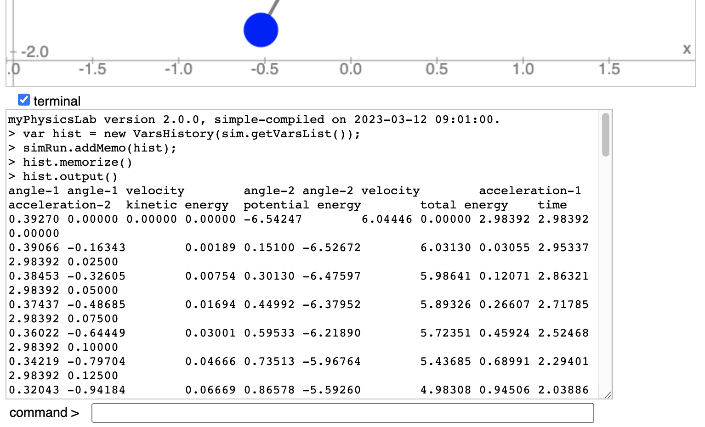

CSS: ./Overview_2.css
Title: Getting Numbers with VarsHistory
HTML Header: <meta name="viewport" content="width=device-width, initial-scale=1">

[myPhysicsLab Documentation](index.html)

# Getting Numbers with VarsHistory

To get numeric data from a myPhysicsLab simulation using the VarsHistory class, follow the steps below.
- See [VarsHistory](./classes/lab_graph_VarsHistory.VarsHistory.html) for details
    and all available options.
- For more control over the output see
[Getting Numbers with Javascript](GetNumbers2.html). 

Open the terminal window by clicking the "terminal" checkbox.

&nbsp;

&nbsp;

Type `help` in the command box (and hit return of course) to see available Terminal
commands.

Set your desired initial conditions on the simulation. Type or paste into the Terminal
command box:

    var hist = new VarsHistory(sim.getVarsList());
    simRun.addMemo(hist);
    hist.memorize();

To memorize the starting initial conditions, we call the `memorize()` function once
before starting the simulation.

Run the simulation as long as you want. Click the "stop" button (or use a script to
automatically stop at a certain time). In the Terminal command box type:

    hist.output() 

This will print the data in Terminal output box. (Note: Don't type a semi-colon ";" at
the end of that line, the semi-colon suppresses the output in Terminal).

Here is how this would look in the
[Double Pendulum](https://www.myphysicslab.com/develop/build/sims/pendulum/DoublePendulumApp-en.html?reset;show-terminal=true) simulation.

The first line contains the names of the
variables. You can then select the text, copy and paste to a spreadsheet or text file.
For example I was able to generate this graph from the Double Pendulum with a
[simple Python program](dbl-pendulum-graph.html).

&nbsp;

## Options Available for VarsHistory

The default separator between numbers is the tab character. To instead use comma separated values:

    hist.setSeparator(', ');

Use `setNumberFormat` to change the number formatting function. For example to show only two decimal places

    hist.setNumberFormat((n) => n.toFixed(2));

You can use
[Javascript's Number.toExponential](https://developer.mozilla.org/en-US/docs/Web/JavaScript/Reference/Global_Objects/Number/toExponential)
or one of the `myphysicslab.lab.Util` number format functions like
[Util.NF5E](./classes/lab_util_Util.Util.html#NF5E).
The above example uses an [arrow function](https://developer.mozilla.org/en-US/docs/Web/JavaScript/Reference/Functions/Arrow_functions)
but you can provide any function that takes one numeric argument and returns a string.  Here is an equivalent non-arrow function:

    hist.setNumberFormat(function(n) { return n.toFixed(2)});

To change which variables are sampled or their order use `setVariables`. For example:

    hist.setVariables([9,0,1,2,3])

Find the index numbers of the variables by typing the command `names` into the Terminal
command box. In the
[Double Pendulum](https://www.myphysicslab.com/develop/build/sims/pendulum/DoublePendulumApp-en.html?reset;show-terminal=true)
simulation you would see this

    SIM_VARS.ANGLE_1;
    SIM_VARS.ANGLE_1_VELOCITY;
    SIM_VARS.ANGLE_2;
    SIM_VARS.ANGLE_2_VELOCITY;
    SIM_VARS.ACCELERATION_1;
    SIM_VARS.ACCELERATION_2;
    SIM_VARS.KINETIC_ENERGY;
    SIM_VARS.POTENTIAL_ENERGY;
    SIM_VARS.TOTAL_ENERGY;
    SIM_VARS.TIME

So variable 0 is `ANGLE_1`, variable 1 is `ANGLE_1_VELOCITY`, etc. Another way to find
index numbers of variables is with the command `prettyPrint(varsList)` which in the
Double Pendulum produces

    > prettyPrint(varsList)
    VarsList{
      name_: "SIM_VARS",
      numVars: 10,
      timeIdx_: 9,
      history_: false,
      (0) ANGLE_1: 0.39270,
      (1) ANGLE_1_VELOCITY: 0.00000,
      (2) ANGLE_2: 0.00000,
      (3) ANGLE_2_VELOCITY: 0.00000,
      (4) ACCELERATION_1: -6.54247,
      (5) ACCELERATION_2: 6.04446,
      (6) KINETIC_ENERGY: 0.00000,
      (7) POTENTIAL_ENERGY: 2.98392,
      (8) TOTAL_ENERGY: 2.98392,
      (9) TIME: 0.00000,

Note that calling `setVariables` erases all stored data from the VarsHistory. Therefore
you should call `memorize` afterwards to store the initial conditions.

Here is a Terminal session that shows using several of these commands together in the Double Pendulum simulation.

    > var hist = new VarsHistory(sim.getVarsList());
    > simRun.addMemo(hist);
    > hist.setNumberFormat((n) => n.toFixed(2));
    > hist.setSeparator(',   ');
    > hist.setVariables([9,0,1,2,3]);
    > hist.memorize();
    > hist.output()
    time,   angle-1,   angle-1 velocity,   angle-2,   angle-2 velocity
    0.00,   0.39,   0.00,   0.00,   0.00
    0.03,   0.39,   -0.16,   0.00,   0.15
    0.05,   0.38,   -0.33,   0.01,   0.30
    0.08,   0.37,   -0.49,   0.02,   0.45
    0.10,   0.36,   -0.64,   0.03,   0.60
    0.13,   0.34,   -0.80,   0.05,   0.74
    0.15,   0.32,   -0.94,   0.07,   0.87
    0.18,   0.30,   -1.08,   0.09,   0.98
    0.20,   0.27,   -1.19,   0.12,   1.08
    0.23,   0.24,   -1.29,   0.14,   1.15
    0.25,   0.20,   -1.36,   0.17,   1.19

&nbsp;

&nbsp;

