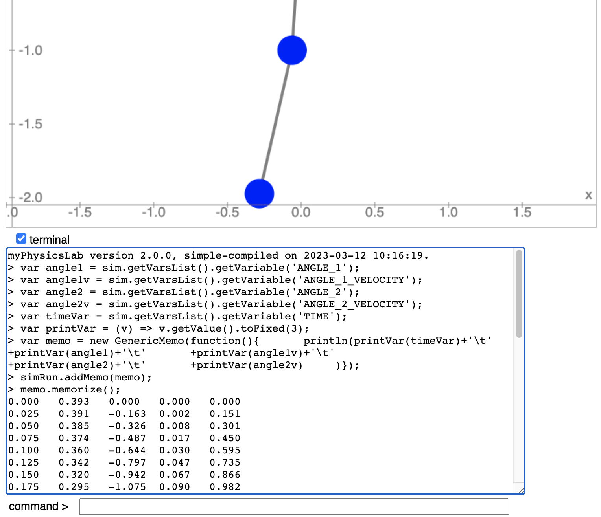

CSS: ./Overview_2.css
Title: Getting Numbers with Javascript
HTML Header: <meta name="viewport" content="width=device-width, initial-scale=1">

[myPhysicsLab Documentation](index.html)

# Getting Numbers with Javascript

To get numeric data from a myPhysicsLab simulation using Javascript, follow the steps
below.
- To do this with less coding see [Getting Numbers with VarsHistory](GetNumbers1.html).

Open the terminal window by clicking the "terminal" checkbox.

&nbsp;

Type `help` in the command box (and hit return of course) to see available Terminal
commands.

Set your desired [initial conditions](Set_Initial_Conditions.html) on the simulation.

Find the names of the variables by typing `names` into the Terminal command box. For the
[Double Pendulum](https://www.myphysicslab.com/develop/build/sims/pendulum/DoublePendulumApp-en.html?reset;show-terminal=true)
simulation you would see this

    SIM_VARS.ANGLE_1;
    SIM_VARS.ANGLE_1_VELOCITY;
    SIM_VARS.ANGLE_2;
    SIM_VARS.ANGLE_2_VELOCITY;
    SIM_VARS.ACCELERATION_1;
    SIM_VARS.ACCELERATION_2;
    SIM_VARS.KINETIC_ENERGY;
    SIM_VARS.POTENTIAL_ENERGY;
    SIM_VARS.TOTAL_ENERGY;
    SIM_VARS.TIME

Enter the following script into the Terminal command box.  (You can copy and paste all
the lines at once.)

    var angle1 = sim.getVarsList().getVariable('ANGLE_1');
    var angle1v = sim.getVarsList().getVariable('ANGLE_1_VELOCITY');
    var angle2 = sim.getVarsList().getVariable('ANGLE_2');
    var angle2v = sim.getVarsList().getVariable('ANGLE_2_VELOCITY');
    var timeVar = sim.getVarsList().getVariable('TIME');
    var printVar = (v) => v.getValue().toFixed(3);
    var memo = new GenericMemo(function(){
      println(printVar(timeVar)+'\t'
      +printVar(angle1)+'\t'
      +printVar(angle1v)+'\t'
      +printVar(angle2)+'\t'
      +printVar(angle2v)
    )});
    simRun.addMemo(memo);
    memo.memorize();

To memorize the starting initial conditions, call the `memorize()` function once before
starting the simulation.

Modify the `printVar` function to format the numbers however you want.
For example you can use
[Javascript's Number.toExponential](https://developer.mozilla.org/en-US/docs/Web/JavaScript/Reference/Global_Objects/Number/toExponential)
or one of the `myphysicslab.lab.Util` number format functions like
[Util.NF5E](./classes/lab_util_Util.Util.html#NF5E).

To see it working [try this link](https://www.myphysicslab.com/develop/build/sims/pendulum/DoublePendulumApp-en.html?reset;show-terminal=true;var%20angle1=sim.getVarsList().getVariable('ANGLE_1');var%20angle1v=sim.getVarsList().getVariable('ANGLE_1_VELOCITY');var%20angle2=sim.getVarsList().getVariable('ANGLE_2');var%20angle2v=sim.getVarsList().getVariable('ANGLE_2_VELOCITY');var%20timeVar=sim.getVarsList().getVariable('TIME');var%20printVar=(v)=>v.getValue().toFixed(3);var%20memo=new%20GenericMemo(function(){println(printVar(timeVar)+'\t'+printVar(angle1)+'\t'+printVar(angle1v)+'\t'+printVar(angle2)+'\t'+printVar(angle2v))});pause;simRun.addMemo(memo);memo.memorize();) (and click the "play" button).

Run the simulation as long as you want. Click the "stop" button (or use a script to
automatically stop at a certain time). You will see output like this:

Select the numeric text, copy and paste to a spreadsheet or text file.
For example, here is a graph generated from the Double Pendulum with a
[simple Python program](dbl-pendulum-graph.html).

## Change Time Interval for Printing

To print less data, modify the script to use a time interval. The `lastPrint` variable
remembers when we last printed data.

    var angle1 = sim.getVarsList().getVariable('ANGLE_1');
    var angle1v = sim.getVarsList().getVariable('ANGLE_1_VELOCITY');
    var angle2 = sim.getVarsList().getVariable('ANGLE_2');
    var angle2v = sim.getVarsList().getVariable('ANGLE_2_VELOCITY');
    var timeVar = sim.getVarsList().getVariable('TIME');
    var printVar = (v) => v.getValue().toFixed(3);
    var lastPrint = -1;
    var memo = new GenericMemo(function(){
      var t=timeVar.getValue();
      if (t-lastPrint>=0.24) {
        lastPrint=t;
        println(printVar(timeVar)+'\t'
            +printVar(angle1)+'\t'
            +printVar(angle1v)+'\t'
            +printVar(angle2)+'\t'
            +printVar(angle2v))
      }
    });
    simRun.addMemo(memo);
    memo.memorize();

(Note we use 0.24 instead of 0.25 to get output every 0.25 seconds, because the
underlying time step is 0.025 and numerical errors mean time is not always an exact
multiple of 0.025.)

Here is output from running the above script in the Double Pendulum simulation. Time is
in the first column.

    0.000	0.393	0.000	0.000	0.000
    0.250	0.202	-1.363	0.173	1.185
    0.500	-0.108	-0.836	0.354	-0.092
    0.750	-0.160	0.443	0.094	-1.909
    1.000	-0.003	0.404	-0.404	-1.474
    1.250	-0.020	-0.515	-0.525	0.523
    1.500	-0.226	-0.881	-0.188	1.810
    1.750	-0.292	0.476	0.130	0.513
    2.000	-0.010	1.581	0.056	-0.914
    2.250	0.308	0.676	-0.087	0.109
    2.500	0.284	-0.821	0.135	1.549
    2.750	0.039	-0.792	0.480	0.717

&nbsp;

&nbsp;

