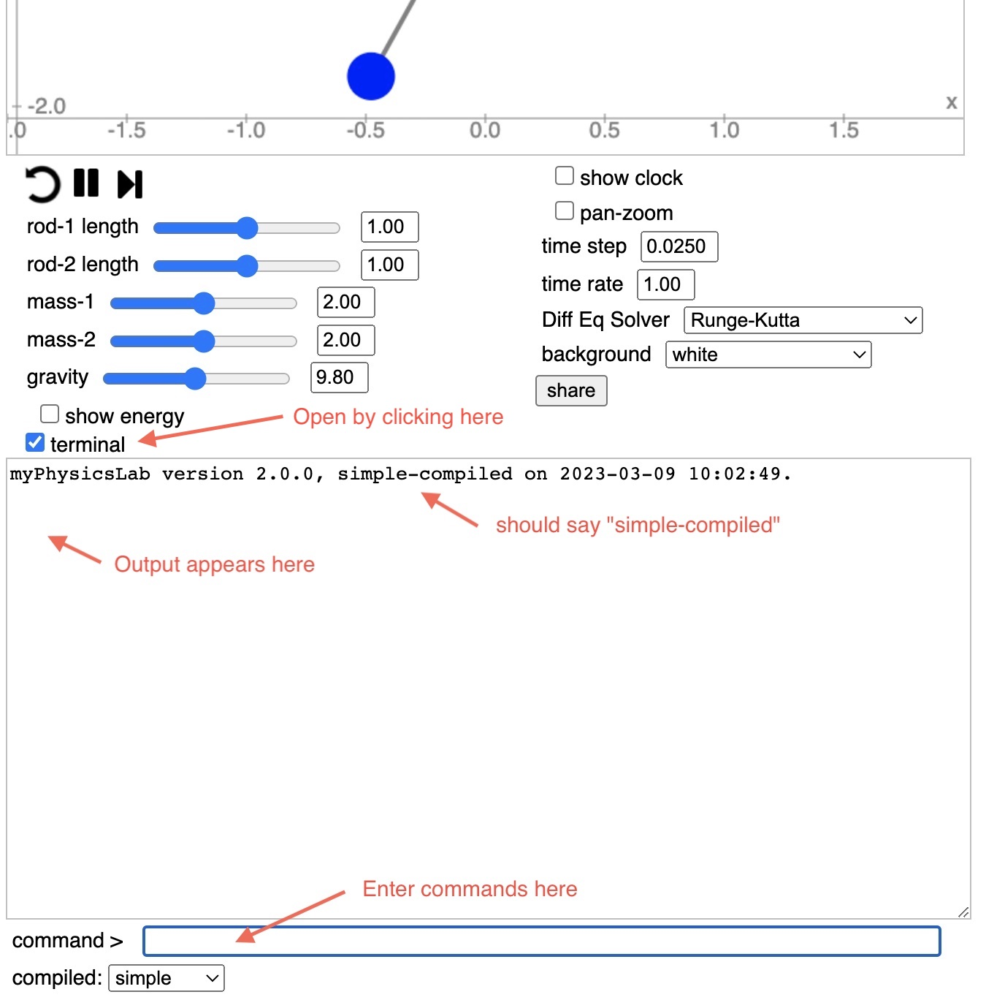

CSS: ./Overview_2.css
Title: Stop Simulation at a Certain Time
HTML Header: <meta name="viewport" content="width=device-width, initial-scale=1">

[myPhysicsLab Documentation](index.html)

# Stop Simulation at a Certain Time

To stop a simulation at a specified time, try the following script.

Open the terminal window by clicking the "terminal" checkbox.

&nbsp;

Make sure you are using the [simple-compiled](Building.html#advancedvs.simplecompile)
version of the simulation. There should be a link to the simple-compiled version on the
simulation's web page, or find it in the
[set of simple-compiled applications](https://www.myphysicslab.com/develop/build/index-en.html).

Type `help` in the command box (and hit return of course) to see available Terminal
commands.

Set your desired initial conditions on the simulation.

Paste into the Terminal command box this script

    var stopTime = 1.99;
    var memo = new GenericMemo(function(){
      if (sim.getTime()>=stopTime) { simRun.pause() }
    });
    simRun.addMemo(memo);

Check that time time is set to zero by typing `time` or `sim.getTime()` in the Terminal command box.  If time is not zero, click the reset button or execute the `reset` command. 

Start the simulation running, it will stop once the time exceeds the `stopTime`.

To continue running the simulation after it stops:

- set the `stopTime` to a later time, for example `stopTime = 3.99`
- or execute `simRun.removeMemo(memo)` in the Terminal command box

A GenericMemo is called whenever the simulation steps forward in time. Therefore the
only way to cancel it is to remove it, or change its `stopTime` to far in the future.

## Stop Simulation at a Certain Energy

Similar techniques can be used to stop the simulation based on other conditions. For example, to stop the simulation when the energy drops below a certain value.

Determine which variable holds the energy.
Find the names of the variables by typing `names` into the Terminal command box. For the
[Double Pendulum](https://www.myphysicslab.com/develop/build/sims/pendulum/DoublePendulumApp-en.html)
simulation you would see this

    SIM_VARS.ANGLE_1;
    SIM_VARS.ANGLE_1_VELOCITY;
    SIM_VARS.ANGLE_2;
    SIM_VARS.ANGLE_2_VELOCITY;
    SIM_VARS.ACCELERATION_1;
    SIM_VARS.ACCELERATION_2;
    SIM_VARS.KINETIC_ENERGY;
    SIM_VARS.POTENTIAL_ENERGY;
    SIM_VARS.TOTAL_ENERGY;
    SIM_VARS.TIME

Enter the following script into the Terminal command box.  (You can copy and paste all
the lines at once.)

    var energyVar = sim.getVarsList().getVariable('TOTAL_ENERGY');
    var energyLimit = 0.1;
    var memo = new GenericMemo(function(){
      if (energyVar.getValue() < energyLimit) { simRun.pause()}
    });
    simRun.addMemo(memo);

Check that time time is set to zero by typing `time` or `sim.getTime()` in the Terminal command box.  If time is not zero, click the reset button or execute the `reset` command. 

Start the simulation running, it will stop once the total energy drops below `energyLimit`.

To continue running the simulation after it stops:

- set the `energyLimit` to a lower value, for example `energyLimit = 0.01`
- or execute `simRun.removeMemo(memo)` in the Terminal command box

## Other Scriptable Tasks

Here are some other tasks that can be triggered by various events.

- Change the time rate of the `clock` to slow down or speed up at a certain
    time. See the `setTimeRate` method of
    [Clock](myphysicslab.lab.util.Clock.html).

- Print information when certain events happen using the `println` command
    which is available in [Terminal](myphysicslab.lab.util.Terminal.html). For
    example, when an object's position crosses a certain line you can print the time
    and other variables.

- Cause a simulation to loop, going back to time zero, by executing
    `simRun.reset()` at a certain time. See the `reset` method of
    [SimRunner](myphysicslab.lab.app.SimRunner.html).

- Change a parameter like gravity or damping at a certain time.

## Using ClockTask to Stop a Simulation

Another way to stop a simulation at a certain time is to create a
[ClockTask](myphysicslab.lab.util.ClockTask.html)
and add it to a
[Clock](myphysicslab.lab.util.Clock.html).
For example, this script stops the simulation after 2 seconds.

    var task = new ClockTask(2, () => simRun.pause());
    clock.addTask(task);

A ClockTask is executed only once when the time on the clock reaches the scheduled time for the task.  After the task stops the simulation at 2 seconds, you could hit "play" and the simulation would continue.

But if you rewind (reset) the simulation to time zero, the ClockTask is still active and will again stop the simulation at 2 seconds.  You can cancel the task with

    clock.removeTask(task);

Here is a ClockTask that restarts the simulation every 2 seconds. 

    var task = () => simRun.reset();
    clock.addTask(new ClockTask(2, task));

Here is a ClockTask that slows the time rate the Clock after 2 seconds:

    var task = new ClockTask(2, () => clock.setTimeRate(0.1));
    clock.addTask(task);

## Using GenericObserver to React to Events

Another way to execute a script is by making a
[GenericObserver](myphysicslab.lab.util.GenericObserver.html)
that looks for certain events to occur.

Suppose you have installed one of the above scripts that slows the time rate of the Clock.  You run the simulation, and it slows down.  But now you want to try it again. It's annoying to need to manually reset the time rate to 1 every time. Here is a script that does that automatically whenever you hit the rewind (reset) button.

    var obs = new GenericObserver(simRun, evt => {
      if (evt.nameEquals('RESET')) {
          clock.setTimeRate(1);
      }
    });

Whenever the GenericObserver sees a RESET event on the SimRunner, it sets the time rate on the clock.

There are many Events being broadcast by various objects all the time.  For example a Clock broadcasts whenever it starts or stops (pause or resume). See
the section about [Subject-Observer](Architecture.html#subjectobserverparameter) in the
Architecture overview.

&nbsp;

&nbsp;

