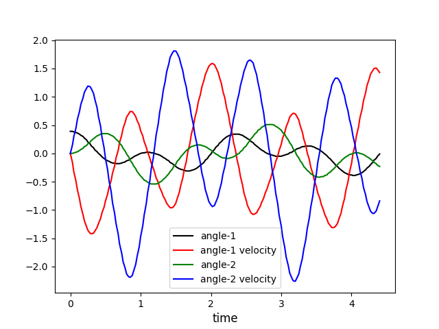

CSS: ./Overview_2.css
Title: Python program for graphing Double Pendulum
HTML Header: <meta name="viewport" content="width=device-width, initial-scale=1">

[myPhysicsLab Documentation](index.html)

# Python program for graphing Double Pendulum

Here is an example Python program for graphing numeric data from the Double Pendulum simulation. See [Getting Numbers with VarsHistory](GetNumbers1.html) for how to obtain the numeric data.

    # graph data in the file dbl-pendulum-data.txt
    # that file was created in the DoublePendulum simulation on myphysicslab
    # using the following script:
    #    var hist = new VarsHistory(sim.getVarsList());
    #    simRun.addMemo(hist);
    #    hist.setNumberFormat((n) => n.toFixed(2));
    #    hist.setVariables([9,0,1,2,3]);
    #    hist.memorize()
    # the variables in the file are:
    # time	angle-1	angle-1 velocity	angle-2	angle-2 velocity
    import matplotlib.pyplot as plt
    hnd = open("dbl-pendulum-data.txt", "r")
    # arrays to collect (x,y) points for later plotting
    ta = [] # time array
    ya1 = []
    ya2 = []
    ya3 = []
    ya4 = []
    line = 0
    while True:
    	buff = hnd.readline()
    	if not buff:
    		break
    	line += 1
    	buff=buff.strip()
    	if line==1:
    		names = buff.split('\t')
    	if line>1:
    		b = [float(x) for x in buff.split()]
    		if (len(b)<5):
    			continue
    		ta.append(b[0])
    		ya1.append(b[1])
    		ya2.append(b[2])
    		ya3.append(b[3])
    		ya4.append(b[4])
    hnd.close()
    plt.plot(ta, ya1, 'k', label=names[1])
    plt.plot(ta, ya2, 'r', label=names[2])
    plt.plot(ta, ya3, 'g', label=names[3])
    plt.plot(ta, ya4, 'b', label=names[4])
    plt.xlabel('time', fontsize=12)
    plt.legend()
    plt.show()

It produces this graph

The data file begins with the following lines

    time	angle-1	angle-1 velocity	angle-2	angle-2 velocity
    0.00	0.39	0.00	0.00	0.00
    0.03	0.39	-0.16	0.00	0.15
    0.05	0.38	-0.33	0.01	0.30
    0.08	0.37	-0.49	0.02	0.45
    0.10	0.36	-0.64	0.03	0.60
    0.13	0.34	-0.80	0.05	0.74
    0.15	0.32	-0.94	0.07	0.87
    0.18	0.30	-1.08	0.09	0.98
    0.20	0.27	-1.19	0.12	1.08
    0.23	0.24	-1.29	0.14	1.15
    0.25	0.20	-1.36	0.17	1.19
    0.28	0.17	-1.41	0.20	1.18
    0.30	0.13	-1.42	0.23	1.14
    0.33	0.10	-1.41	0.26	1.06
    0.35	0.06	-1.37	0.28	0.95
    0.38	0.03	-1.31	0.31	0.81

&nbsp;

&nbsp;

